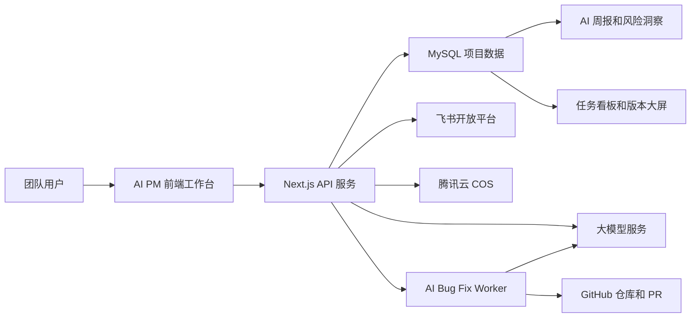

# AI PM 智能项目管理平台 AI 应用参选报告

## 案例名称

AI PM 智能项目管理平台：面向项目交付全流程的 AI 协同管理实践

## 一、案例简介

AI PM 智能项目管理平台是一套面向产品、研发、测试、项目管理及业务协同团队的 AI 原生项目管理系统。平台围绕真实项目交付过程中的需求管理、任务拆解、版本推进、风险识别、Bug 跟踪、周报生成、成员协同和研发修复等关键环节，将大模型能力嵌入业务流程，帮助团队从传统的人工跟进项目，升级为由数据驱动、AI 辅助、流程闭环支撑的智能项目管理模式。

在传统项目管理场景中，团队经常面临需求文档信息密集、任务拆解依赖经验、进度汇总耗时、风险发现滞后、Bug 流转不透明、周报口径不统一等问题。项目经理和产品经理需要在大量沟通、表格、文档和会议之间反复切换，既消耗时间，也容易出现信息遗漏和判断滞后。

AI PM 平台以项目数据为底座，将项目、版本、任务、需求、风险、Bug、成员、文档和 AI 洞察统一沉淀到系统中，再通过 AI 进行结构化分析、内容生成和风险判断。平台不是单纯的 AI 问答工具，而是将 AI 融入项目管理动作本身，使 AI 在需求进入、任务生成、执行跟踪、质量处理和管理汇报中持续发挥作用。

目前平台已形成较完整的 AI 项目管理闭环：需求文档可由 AI 辅助拆解为任务，项目进度可通过版本大屏和任务看板实时展示，风险和严重 Bug 可被集中识别，周报可基于真实数据自动生成，Bug 可进一步触发 AI 修复 MR/PR 的探索能力，并通过飞书登录、负责人选择和机器人通知接入团队日常协同链路。

该案例体现了 AI 从“生成内容”到“参与流程”的升级，也体现了企业内部 AI 应用从工具化尝试走向业务系统化落地的实践价值。

## 二、建设背景与业务痛点

项目管理是产品研发团队中高频、复杂且高度依赖协同的工作。随着项目数量增加、交付节奏加快、跨角色协作增多，传统人工管理方式逐渐暴露出明显瓶颈。

### 1. 需求进入后难以快速转化为可执行任务

需求文档通常包含业务目标、功能说明、交互规则、验收标准和边界条件。产品经理需要人工阅读并拆解为研发任务、测试事项和版本计划。这个过程耗时较长，也容易因为个人经验差异导致拆解颗粒度不一致。

### 2. 项目进度依赖人工汇总，管理者难以及时掌握真实状态

任务分布在不同负责人、不同版本和不同阶段中，项目经理需要不断询问、汇总、确认和更新。信息一旦滞后，项目看板就无法反映真实交付状态，管理者也难以及时判断是否存在延期风险。

### 3. 风险与阻塞发现不及时

逾期任务、严重 Bug、负责人负载、版本延期、需求变更等风险往往分散在多个模块中。传统方式主要依赖项目经理经验判断，容易出现“问题已经发生，但组织还没有形成统一认知”的情况。

### 4. 周报和复盘重复劳动多，内容质量不稳定

项目周报需要汇总项目进度、任务完成情况、Bug 质量、风险阻塞、下周计划和需要协调的事项。人工撰写不仅耗时，也容易出现口径不一致、重点不突出、数据不完整的问题。

### 5. Bug 处理链路长，研发定位和修复成本高

Bug 从发现、登记、分派、复现、定位、修复到提交 MR/PR，涉及多个角色和系统。如果缺少上下文聚合和自动化辅助，问题处理效率会受到明显影响。

AI PM 平台正是围绕上述痛点进行设计，将 AI 能力嵌入实际管理流程，让项目数据自动沉淀，让 AI 负责重复整理和初步分析，让人负责判断、决策和最终确认。

## 三、核心亮点

### 1. 从单点 AI 工具升级为流程型 AI 应用

平台并非只提供一个 AI 聊天入口，而是把 AI 能力拆入项目管理的关键节点。用户在上传需求、拆解任务、查看风险、处理 Bug、导出周报时，都可以自然使用 AI 能力。AI 输出基于站内真实数据和上下文，不是脱离业务的泛化回答。

这一设计使 AI 真正进入业务流程，形成“数据沉淀、智能分析、人工确认、流程推进”的闭环。

### 2. AI 自动生成项目周报，提升管理汇报效率

平台可基于项目、任务、版本、Bug、风险、需求和文档摘要自动生成 Markdown 周报。周报包含本周结论、核心指标、项目概览、版本推进、任务进展、Bug 情况、风险阻塞、需求文档、下周计划和待决策事项。

AI 周报不是简单润色文本，而是基于结构化数据生成。系统会限制模型只使用平台提供的数据，避免编造不存在的项目、负责人、任务和日期，从而保证报告内容更可靠、更可追踪。

### 3. 需求文档 AI 拆解，打通需求到执行的关键环节

平台支持上传需求文档，并由 AI 提取需求目标、功能点、验收标准、风险点和任务建议。产品经理可以在 AI 初稿基础上快速确认和调整，减少从文档到任务看板的人工转换成本。

该能力尤其适合需求文档较长、涉及多角色协作、版本计划复杂的场景，有助于减少需求遗漏、任务颗粒度不一致和跨角色理解偏差。

### 4. 项目健康度与风险智能预警

平台通过任务逾期、项目进度、Bug 严重程度、风险等级、负责人分布和版本状态等信息，辅助识别项目健康度。管理者可以更早看到高风险事项、阻塞问题和质量隐患，从而提前调整资源和优先级。

传统项目管理往往是“项目延期后再复盘”，AI PM 更强调“风险发生前先提醒”，帮助团队从被动处理转向主动管理。

### 5. Bug AI 修复 MR 能力，探索研发提效新模式

平台在 Bug 管理模块中进一步探索 AI 自动修复能力。用户可从 Bug 详情发起 AI 修复任务，后台 Worker 自动读取 Bug、版本、项目、附件和仓库配置，拉取代码，创建修复分支，调用 AI Coding Runner 修改代码，运行校验，并创建 MR/PR。

该能力坚持安全边界：AI 不自动合并代码，不绕过人工 Review，不绕过 CI，不修改密钥、凭据和高风险配置。AI 的定位是研发提效助手，负责辅助定位和生成初步修复，最终质量仍由工程流程保障。

### 6. 飞书协同集成，打通 AI 分析与组织执行

平台接入飞书 OAuth 登录、通讯录负责人选择和机器人通知能力。负责人、成员权限和通知链路能够与组织协同体系结合，AI 生成的风险提醒、任务流转和质量信息可以进入团队日常工作流。

这使 AI 不只是停留在系统页面中，而是能够推动具体负责人行动，形成责任闭环。

### 7. 数据资产持续沉淀，支撑长期管理优化

平台将项目、任务、Bug、风险、需求、版本和成员数据统一存储在 MySQL 中，形成可复用的数据资产。后续可进一步支持项目复盘、交付预测、团队负载分析、质量趋势分析和管理决策辅助。

对组织而言，这不是一次性的 AI 使用，而是持续积累项目知识资产和管理能力的基础设施。

## 四、使用的 AI 工具

| AI 工具或能力 | 应用场景 | 价值说明 |
| --- | --- | --- |
| AI PM 内置 AI 助手 | 项目问答、任务分析、风险解释、管理建议 | 让用户基于当前项目上下文获得即时分析 |
| OpenAI-compatible Chat Completions 接口 | 统一接入 DeepSeek 或兼容大模型服务 | 保持模型接入灵活性，便于后续替换和扩展 |
| AI 周报生成模块 | 自动生成个人或团队项目周报 | 减少人工汇总，提升报告结构化和专业性 |
| AI 需求文档解析模块 | 从需求文档中识别任务、验收标准和风险 | 提升需求拆解效率，减少遗漏 |
| AI 风险分析能力 | 结合任务、Bug、风险和版本数据判断项目状态 | 帮助项目经理提前识别延期和质量隐患 |
| AI Bug 修复 Runner | 根据 Bug 上下文生成代码修复分支和 MR/PR | 探索从问题登记到研发修复的自动化提效 |
| 飞书机器人通知 | 任务、负责人、风险和协同提醒 | 将 AI 分析结果推送到团队工作流 |

## 五、使用的核心技术

### 1. 前端应用技术

| 技术 | 作用 |
| --- | --- |
| Next.js 16 App Router | 构建全栈应用路由、页面渲染和 API 路由 |
| React 19 | 构建项目管理平台的交互式前端界面 |
| TypeScript | 提升项目数据结构、接口和组件开发的类型安全 |
| Ant Design 6 | 提供表格、表单、抽屉、看板、筛选器等企业级 UI 能力 |
| Less | 管理平台级样式和组件样式 |

### 2. 后端与数据技术

| 技术 | 作用 |
| --- | --- |
| Next.js API Routes | 承载登录、项目数据、AI 调用、Bug 修复任务等服务端接口 |
| MySQL | 持久化项目、任务、版本、需求、风险、Bug、成员和 AI 修复任务数据 |
| Prisma | 管理数据库模型、迁移、查询和数据访问 |
| Prisma MariaDB Adapter | 支撑 MySQL 协议连接和生产数据库访问 |
| 本地种子数据初始化 | 在数据库为空时初始化演示和基础业务数据 |

### 3. AI 能力接入技术

| 技术 | 作用 |
| --- | --- |
| OpenAI-compatible API | 统一调用兼容大模型服务，支持 DeepSeek 等模型 |
| Prompt 模板化设计 | 约束 AI 输出格式，保证周报、分析结果和任务拆解结构稳定 |
| 结构化上下文裁剪 | 只向 AI 提供与当前用户、项目、任务、Bug、风险相关的数据 |
| Markdown 生成约束 | 让 AI 周报直接生成可复制、可归档、可传播的标准文档 |
| 本地规则兜底 | 当模型接口不可用时提供基础分析能力，保证系统可用性 |

### 4. 协同与组织集成技术

| 技术 | 作用 |
| --- | --- |
| 飞书 OAuth | 支持企业用户登录和身份识别 |
| 飞书通讯录 API | 支持负责人选择和成员身份映射 |
| 飞书机器人消息 | 支持任务、风险、Bug 等协同通知 |
| 工作区成员权限模型 | 支持 owner、admin、productAdmin、productMember、viewer 等角色 |
| 会话与 Cookie 管理 | 保证登录态、安全访问和本地演示模式兼容 |

### 5. 研发自动化技术

| 技术 | 作用 |
| --- | --- |
| GitHub Provider | 支持仓库配置、分支推送和 Pull Request 创建 |
| AI Bug Fix Worker | 执行 Bug 修复任务，包括拉取代码、调用 AI、校验、提交和创建 MR/PR |
| 安全路径控制 | 限制 AI 可修改目录，防止触碰密钥、环境变量和高风险文件 |
| 校验命令执行 | 支持 lint、test、build 等工程校验，保证 AI 修复不绕过质量门槛 |
| Docker 部署 | 支持标准化生产部署和环境迁移 |

### 6. 文件与附件能力

| 技术 | 作用 |
| --- | --- |
| 文档解析能力 | 支持需求文档、文本、Markdown、CSV、JSON 等内容分析 |
| 腾讯云 COS | 支持 Bug 复现图片、视频和附件材料存储 |
| 文件元数据记录 | 将附件 URL、对象 Key、类型和大小关联到 Bug 数据中 |

## 六、技术架构说明

平台整体采用“业务数据底座 + AI 能力服务 + 协同集成 + 研发自动化”的架构。前端负责项目管理体验和交互承载，后端负责数据访问、权限控制、AI 调用和第三方集成，数据库沉淀项目过程数据，大模型负责分析和生成，飞书负责组织协同，Worker 负责异步研发自动化任务。

这种架构的优势在于：AI 能力不是孤立模块，而是与项目管理数据、权限、通知和研发流程结合，既能提升效率，也能保持企业级应用所需的可控性和可维护性。

## 七、实际成效与组织价值

### 1. 提升项目管理效率

AI PM 将需求拆解、任务汇总、周报生成、风险识别等高频重复工作交给 AI 辅助完成。项目经理不再需要从多个文档和表格中手工整理信息，而是可以基于系统自动聚合的数据进行判断和补充。

在日常管理中，AI 周报能够快速形成结构化初稿，需求文档可以快速转化为任务建议，风险和 Bug 可以集中展示，使团队把更多时间投入到决策和推进中，而不是重复整理材料。

### 2. 提升项目透明度

平台把任务、Bug、需求、风险、版本和负责人统一关联，管理者可以从一个工作台查看项目状态。每个任务属于哪个版本、谁负责、是否逾期、是否存在阻塞，都可以被清晰呈现。

这种透明度有助于减少信息差，降低跨角色沟通成本，也让项目问题更容易被及时发现。

### 3. 提升交付质量

AI PM 通过风险预警、严重 Bug 聚合、任务逾期识别和版本状态展示，帮助团队更早关注质量隐患。对研发团队而言，Bug AI 修复 MR 能力进一步缩短从问题发现到修复建议的路径，提高问题响应速度。

平台并不让 AI 替代工程质量流程，而是让 AI 辅助完成初步分析和修复，再通过 Review、CI 和人工验证保障最终质量。

### 4. 提升组织协同能力

飞书集成让平台与团队日常办公环境连接起来。成员身份、负责人选择、消息通知和项目数据形成闭环，减少“系统里有记录，但团队不知道”的断点。

AI 生成的分析结果能够进入协同流程，推动负责人采取行动，从而提升组织执行力。

### 5. 形成可复用的 AI 应用范式

AI PM 的价值不仅在于一个项目管理工具本身，也在于形成了一套可复制的企业 AI 应用建设范式：

1. 先沉淀业务数据。
2. 再将数据组织成结构化上下文。
3. 用 Prompt 约束 AI 输出。
4. 将 AI 结果嵌入真实流程。
5. 通过权限、安全和人工确认保证可控。
6. 最终把 AI 能力转化为组织效率。

这种范式可扩展到客户交付、实施管理、运营项目、内部数字化建设、质量管理和研发效能管理等更多场景。

## 八、案例详述

### 1. 需求管理场景

在需求管理中，平台支持将需求文档作为输入，由 AI 自动分析文档内容，提取需求目标、功能点、验收标准和任务建议。过去产品经理需要反复阅读文档并手工拆分任务，现在可以先由 AI 生成初稿，再由产品经理进行确认、调整和补充。

这种方式既保留了人工判断，又提升了需求进入研发流程的速度。对于复杂需求，AI 还能帮助识别可能遗漏的边界条件和验收关注点，减少后续返工。

### 2. 任务与版本推进场景

平台提供任务看板、项目视图和版本大屏，支持按版本、负责人、阶段等维度查看任务状态。团队可以直观看到哪些任务未完成、哪些任务逾期、哪些负责人负载较重、哪些版本存在交付压力。

AI 能够基于这些数据辅助生成项目判断和风险提示，让项目经理更快定位关键问题。

### 3. 风险和质量管理场景

风险中心能力被融入项目管理流程中，平台会结合高风险项、严重 Bug、阻塞任务和延期情况判断项目健康度。管理者无需逐条翻阅所有记录，也能快速看到当前最需要关注的质量和进度问题。

Bug 管理模块则支持复现材料上传、问题流转、负责人跟踪和 AI 修复任务。对研发团队而言，这意味着 Bug 不再只是问题登记表，而可以进一步成为 AI 辅助定位和修复的入口。

### 4. 周报与管理汇报场景

AI 周报生成是平台最直观的效率提升场景。系统会根据当前用户或团队范围，自动聚合项目、任务、Bug、风险、需求、文档和工作区洞察，并按照固定 Markdown 模板生成周报。

周报结构覆盖管理者关心的核心内容：本周结论、核心指标、项目概览、版本推进、任务进展、Bug 情况、风险阻塞、需求文档、下周计划和需要决策的事项。项目经理只需基于 AI 初稿补充重点判断，即可形成可对外同步的正式材料。

### 5. AI 修复 MR 场景

在 Bug 详情页，用户可以触发 AI 生成修复 MR。系统会读取 Bug 描述、复现材料、项目版本、仓库配置和允许修改范围，由后台 Worker 创建修复分支，调用 AI Coding Runner 修改代码，并执行 lint、test、build 等校验命令。

如果修复成功，系统会提交代码、推送分支并创建 MR/PR，同时把链接、摘要、改动文件和校验结果写回数据库。人工仍然负责 Review、验证和合并，AI 负责缩短初步定位和修复准备时间。

这一能力体现了 AI 在研发流程中的深入应用，也体现了平台对安全边界和工程治理的重视。

## 九、创新价值

### 1. AI 与项目管理流程深度融合

平台不是把 AI 作为附加功能，而是把 AI 放入需求、任务、风险、Bug 和周报等核心流程，使 AI 成为项目管理过程中的实际生产力。

### 2. 结构化数据驱动 AI 输出

AI 输出基于平台沉淀的真实项目数据，避免泛化回答和无依据生成。通过结构化上下文和 Prompt 约束，平台提高了 AI 输出的稳定性和可信度。

### 3. 同时覆盖管理提效和研发提效

多数 AI 管理工具只停留在文档生成和报告总结层面，AI PM 进一步覆盖 Bug 修复 MR/PR 场景，将 AI 从管理端延伸到研发执行端。

### 4. 强调企业级可控性

平台在权限、数据、AI 调用、Bug 修复、Git 操作和第三方集成上设置了清晰边界。AI 可以辅助分析和生成，但关键动作仍由人工确认，符合企业内部系统对安全和可控的要求。

## 十、推广价值

AI PM 的建设方式具有较强复制性。只要团队存在需求拆解、任务推进、风险跟踪、Bug 管理、周报汇报和跨角色协作，就可以复用该模式。

可推广场景包括：

1. 软件研发项目管理。
2. 产品需求和版本管理。
3. 客户交付和实施项目管理。
4. 内部数字化建设项目。
5. 运维改造和系统升级项目。
6. 质量管理和缺陷闭环。
7. 运营活动和跨部门协作项目。

该平台后续还可继续扩展 AI 预测交付风险、自动生成复盘报告、团队负载分析、需求质量评分、智能排期建议和跨项目资源协调等能力，进一步提升组织级项目管理成熟度。

## 十一、AI 相关文档咨询

本案例可配套参考以下文档或材料：

1. AI PM 平台建设说明。
2. AI 周报生成说明。
3. AI 需求文档解析说明。
4. AI Bug 自动修复 MR 技术方案。
5. 飞书协同集成说明。
6. 项目管理数据模型说明。
7. 项目风险识别与健康度分析说明。
8. 项目部署与运维说明。

## 十二、参选总结

AI PM 智能项目管理平台的核心价值，在于把 AI 从单次问答和内容生成，推进到真实项目管理流程中。它以项目数据为基础，以 AI 分析为能力，以飞书协同和研发自动化为延伸，形成覆盖需求、任务、版本、风险、Bug 和周报的完整管理闭环。

该案例既解决了项目管理中的实际效率问题，也探索了 AI 在企业内部系统中的可控落地方式。它不是为了展示 AI 而使用 AI，而是围绕真实业务痛点设计 AI，让 AI 成为项目交付、质量管理和组织协同中的稳定助力。

因此，AI PM 具备较强的创新性、实用性、可复制性和组织价值，适合作为 AI 应用优秀案例进行参选。
