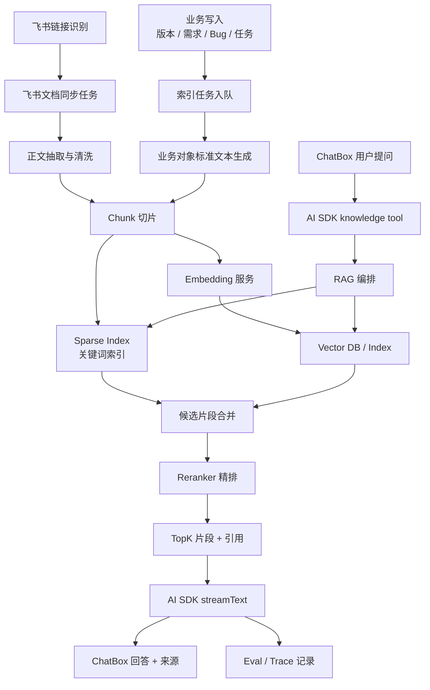

# AI PM 自动索引 RAG 技术方案

## 1. 背景

AI PM 当前的 AI 助手已经能读取工作区内的结构化项目数据，例如项目、任务、Bug、风险、需求、版本、成员负载和周报上下文。用户现在希望进一步让 AI 助手能够理解更多业务资料，但不希望新增一个独立的“知识库管理”产品入口。

当前产品设计更适合把知识库做成后台能力：

- 用户仍然正常创建版本、需求、Bug、任务，或在业务对象里绑定飞书文档链接。
- 系统在后台自动把这些业务对象和飞书资料同步成 AI 可检索索引。
- ChatBox 提问时自动检索这些索引，并把结果作为 AI SDK tool 的上下文交给模型。
- 用户不需要理解 embedding、chunk、向量库、知识库管理等概念。

因此，本方案的核心不是“新增知识库页面”，而是建设 **业务对象自动 AI 索引层**。

## 2. 目标

### 2.1 产品目标

- 创建或更新版本、需求、Bug、任务后，相关内容自动进入 AI 可检索范围。
- 业务对象中出现飞书文档链接时，系统自动识别并同步飞书正文。
- ChatBox 能回答跨业务对象和飞书文档的问题，并附带来源。
- 用户不用手动维护知识库，也不需要看到“AI 同步中 / 同步失败 / 已同步”等索引状态。

### 2.2 技术目标

- 建立统一 AI 索引源模型，兼容 version、requirement、bug、task、feishu_doc 等来源。
- V1 建成正式异步队列和 worker，业务写入只入队，不同步执行索引、embedding、飞书解析或 Qdrant 写入。
- 支持关键词检索 Sparse Retrieval 和语义检索 Vector Retrieval 的组合。
- V1 即完成 Embedding、Qdrant、Hybrid Retrieval、Reranker 和基础 Eval 的完整检索闭环，预留外部 AI 基座化和独立 embedding 服务的升级路径。
- 业务智能能力优先复用现有 skills + AI SDK tools；当 skills/tool 无法覆盖索引队列、向量检索、workflow、Eval 等基础设施能力时，再采用先进、成熟、TypeScript 友好且用法简单的三方库。
- 继续使用当前 AI SDK ChatBox 主链路，不重写对话层。
- 保持 workspace 级权限隔离，未来支持 project/version 范围过滤。

## 3. 非目标

第一阶段不做以下内容：

- 不新增独立“知识库管理”一级菜单。
- 不做文件上传型知识库。
- 不强制引入独立 AI 中台服务。
- 不在业务写接口里同步执行 embedding 或飞书全文解析，避免保存动作变慢。
- 不把模型最终回答改成手写拼接；仍然通过 AI SDK tools 返回事实，由模型生成自然语言回答。

## 4. 总体架构



## 5. 核心概念

### 5.1 AI 索引源

AI 索引源是“可以被 AI 检索的一份资料来源”。它不等于上传文件，也不等于独立知识库文档。

来源可以是：

- 一个版本。
- 一个需求。
- 一个 Bug。
- 一个任务。
- 一个飞书文档链接。
- 后续也可以是会议纪要、复盘链接、接口文档、测试方案等。

### 5.2 Chunk

Chunk 是把一份资料切成的小片段。AI 检索时不会把整个版本或整篇飞书文档都塞给模型，而是只取最相关的几个 chunk。

### 5.3 Sparse Retrieval

Sparse Retrieval 是关键词检索，适合命中：

- Bug 编号。
- 版本号。
- 接口字段。
- 错误码。
- 人名。
- 项目名。
- 飞书文档标题。

### 5.4 Embedding 和 Vector Retrieval

Embedding 会把文本变成语义向量。Vector Retrieval 用这些向量找“意思相近”的内容，适合命中：

- 同义表达。
- 用户不精确的问法。
- 文档里没有完全相同关键词但含义相关的片段。

### 5.5 Reranker

Reranker 是二次排序器。它会把关键词检索和向量检索拿到的一批候选片段重新排序，挑出最适合当前问题的前几段。

### 5.6 RAG 编排

RAG 编排负责把完整流程串起来：

1. 判断用户问题要查哪个范围。
2. 生成检索 query。
3. 同时调用关键词检索和向量检索。
4. 合并去重。
5. Reranker 精排。
6. 打包来源引用。
7. 交给 AI SDK tool 返回给模型。

## 6. 数据模型设计

### 6.1 `ai_index_sources`

记录每个 AI 索引源。

```txt
ai_index_sources
- id
- workspaceId
- projectId nullable
- versionId nullable
- entityType: version | requirement | bug | task | feishu_doc
- entityId
- sourceProvider: internal | feishu
- sourceType: record | feishu_doc | feishu_wiki
- title
- sourceUrl nullable
- sourceToken nullable
- contentHash
- status: pending | indexing | ready | failed | disabled
- error nullable
- lastIndexedAt nullable
- createdByMemberId nullable
- createdAt
- updatedAt
```

关键约束：

- `workspaceId + entityType + entityId + sourceProvider` 应保持唯一。
- `sourceToken` 只存飞书文档 token，不存敏感 access token。
- 权限过滤以 `workspaceId` 为第一边界，后续叠加 project/version。

### 6.2 `ai_index_chunks`

记录切片后的可检索片段。

```txt
ai_index_chunks
- id
- sourceId
- workspaceId
- projectId nullable
- versionId nullable
- entityType
- entityId
- chunkIndex
- heading nullable
- content
- contentHash
- tokenCount
- sourceUrl nullable
- sourceLocator nullable
- embeddingStatus: pending | ready | failed | skipped
- embeddingModel nullable
- embeddingVectorRef nullable
- sparseText
- createdAt
- updatedAt
```

说明：

- `content` 是原始片段文本。
- `sparseText` 是给关键词检索用的增强文本，可以额外拼入标题、编号、负责人、状态等字段。
- `embeddingVectorRef` 指向 Qdrant 中的向量 point id。V1 已要求接入 Qdrant，因此 ready chunk 必须具备可追踪的向量索引引用；只有索引失败或被明确跳过时才允许为空。
- `sourceLocator` 用于未来定位飞书 block、段落、表格行或内部业务详情页锚点。

### 6.3 `ai_index_jobs`

记录异步索引任务。V1 必须把队列能力做成正式基础设施，而不是简单的“保存后触发一次脚本”。

```txt
ai_index_jobs
- id
- workspaceId
- sourceId nullable
- jobType: index_entity | sync_feishu | embed_chunks | rebuild_source | cleanup_source
- payload
- status: pending | running | success | failed
- retryCount
- nextRunAt nullable
- lockedAt nullable
- lockedBy nullable
- error nullable
- createdAt
- updatedAt
```

说明：

- 业务保存接口只创建 job，不同步执行耗时工作。
- `dedupeKey` 建议放在 payload 或单独唯一字段中，采用 `workspaceId:entityType:entityId:jobType`，同一对象短时间多次保存只保留最后一次待处理任务。
- worker 通过 `pending -> running` 原子抢占任务，并使用 `lockedAt / lockedBy` 避免多实例重复处理。
- running 超过超时时间的任务自动释放为 pending，并递增 `retryCount`。
- 失败按退避策略重试，超过上限后进入 failed，只写后台日志和管理观测，不在普通业务页面展示同步状态。
- `nextRunAt` 用于延迟重试、飞书限流退避和批量重建错峰。
- 支持按 `workspaceId` 控制并发，避免单个工作区大量文档拖垮全局索引。
- 定时补偿任务会扫描 failed、pending、running 超时和过期 source。

## 7. 自动入库触发点

### 7.1 版本

触发时机：

- 创建版本。
- 编辑版本。
- 绑定或修改飞书 PRD 链接。
- 状态、范围、时间计划、负责人发生变化。

索引文本建议：

```txt
类型：版本
版本名称：
所属工作区：
所属项目：
父版本：
目标：
范围：
开始时间：
结束时间：
状态：
负责人：
关联飞书文档：
```

### 7.2 需求

触发时机：

- 创建需求。
- 编辑需求。
- 修改验收标准、优先级、状态、关联版本。
- 绑定或修改飞书需求链接。

索引文本建议：

```txt
类型：需求
需求标题：
需求描述：
验收标准：
优先级：
状态：
关联版本：
负责人：
关联飞书文档：
```

### 7.3 Bug

触发时机：

- 创建 Bug。
- 编辑 Bug。
- 修改严重程度、状态、负责人、修复结论。
- 绑定复盘或问题文档链接。

索引文本建议：

```txt
类型：Bug
Bug 标题：
复现步骤：
影响范围：
严重程度：
状态：
负责人：
关联版本：
修复结论：
关联飞书文档：
```

### 7.4 任务

触发时机：

- 创建任务。
- 编辑任务。
- 修改阶段、负责人、截止时间、完成说明。

第一版建议只索引任务标题、描述、状态、负责人、关联版本，避免任务数量过多导致索引膨胀。

## 8. 飞书链接自动同步

### 8.1 链接识别

在版本、需求、Bug、任务等业务字段中识别飞书链接：

```txt
https://xxx.feishu.cn/docx/...
https://xxx.feishu.cn/wiki/...
```

解析出：

- `sourceType`
- `sourceToken`
- 原始 `sourceUrl`

### 8.2 权限原则

飞书同步需要明确权限来源：

- 优先使用当前已有飞书应用/机器人权限。
- 如果机器人无权限，source 状态为 failed，错误提示“飞书文档无读取权限”。
- 不把用户个人 access token 长期存储到业务库。

### 8.3 同步策略

第一版采用事件入队 + worker 异步执行，不做高频前台轮询：

- 业务对象保存时识别到新飞书链接，自动创建同步任务。
- 如果同步失败，只记录 job/source 错误和后台观测日志，不在业务详情页展示同步状态。
- 定时补偿任务扫描 failed、pending、running 超时和过期 source。

### 8.4 文档正文处理

同步步骤：

1. 拉取飞书文档标题和正文。
2. 清洗无意义空行、样式标记、重复导航文本。
3. 保留标题层级、表格文本、列表项。
4. 生成 chunk。
5. 更新 source 状态。

## 9. 索引流水线

### 9.1 标准流程

```txt
业务保存
  ↓
upsert ai_index_sources
  ↓
insert ai_index_jobs
  ↓
worker 异步抢占 job
  ↓
worker 生成标准文本或同步飞书
  ↓
chunking
  ↓
写入 ai_index_chunks
  ↓
建立 sparse index
  ↓
生成 embedding
  ↓
写入 Vector DB / Index
  ↓
source.status = ready
```

### 9.2 内容哈希

每次索引前计算 `contentHash`。

如果内容没有变化：

- 不重复切片。
- 不重复 embedding。
- 只更新时间戳和关联字段。

### 9.3 异步处理

V1 必须交付正式异步队列和 worker。推荐 worker 形式：

```txt
scripts/ai-index-worker.ts
```

运行方式：

```txt
pnpm ai-index:worker
```

部署方式：

- Docker 内独立 worker 进程。
- Compose 同时启动 `ai-pm`、`ai-index-worker`、`redis`、`qdrant`，生产默认走 BullMQ + Redis，不依赖 Web 进程同步处理索引。
- cron/定时任务只做补偿扫描，不作为主处理链路。

队列运行策略：

- 默认读取 `REDIS_URL=redis://redis:6379`，存在时启用 BullMQ + Redis 正式队列。
- BullMQ 负责 job 去重、延迟执行、并发消费、指数退避重试、完成/失败保留。
- 如果没有配置 `REDIS_URL`，worker 降级为 MySQL `ai_index_jobs` 轮询，供本地或临时部署兜底。
- 默认读取 `QDRANT_URL=http://qdrant:6333` 写入向量索引；Qdrant 在单机 Compose 里只开放内部网络，不默认暴露公网端口。

MySQL 兜底主循环：

```txt
1. 按 nextRunAt、priority、createdAt 拉取 pending job。
2. 用原子更新把 job 从 pending 抢占为 running。
3. 根据 jobType 执行业务对象标准化、飞书同步、chunking、embedding、Qdrant 写入。
4. 成功后写 success，并更新 source/chunk 索引元数据。
5. 失败后写 error，按 retryCount 计算下一次 nextRunAt。
6. 超过 retry 上限后写 failed，只进入后台观测，不打扰普通用户页面。
```

任务拆分建议：

```txt
index_entity
  -> sync_feishu，可选
  -> embed_chunks
  -> cleanup_source
```

其中 `index_entity` 负责从业务对象生成标准文本；`sync_feishu` 负责拉取飞书正文；`embed_chunks` 负责调用百炼 `text-embedding-v4` 并写 Qdrant；`cleanup_source` 负责清理旧 chunk 和失效向量。

## 10. 检索链路

### 10.1 ChatBox tool

新增 AI SDK tool：

```txt
knowledge
```

职责：

- 接收用户问题。
- 读取当前 workspaceId。
- 可选读取 projectId/versionId。
- 调用 RAG 编排。
- 返回最相关的资料片段和来源。

返回结构示例：

```json
{
  "query": "退款失败怎么处理？",
  "matches": [
    {
      "sourceType": "bug",
      "title": "退款失败后状态没有回滚",
      "snippet": "第三方支付返回失败后，订单仍显示退款中...",
      "score": 0.91,
      "sourceUrl": "/workbench?view=bugs&bugId=...",
      "citationId": "1"
    },
    {
      "sourceType": "feishu_doc",
      "title": "V2.3 支付改版 PRD",
      "heading": "退款失败处理",
      "snippet": "退款失败后进入人工审核队列，并记录第三方返回码...",
      "score": 0.88,
      "sourceUrl": "https://xxx.feishu.cn/docx/...",
      "citationId": "2"
    }
  ]
}
```

### 10.2 Hybrid Retrieval

检索步骤：

1. Sparse Retrieval 找关键词相关片段。
2. Vector Retrieval 找语义相关片段。
3. 合并去重。
4. Reranker 重排。
5. 返回 TopK。

V1 必须实现 Hybrid Retrieval + Reranker：Sparse Retrieval 负责精确词召回，Qdrant Vector Retrieval 负责语义召回，Reranker 负责把候选片段精排成最终 TopK。检索编排接口从第一版开始就按“召回 + 精排 + 引用”设计，避免后续再改 ChatBox tool 协议。

### 10.3 引用展示

模型回答后需要带来源：

```txt
参考来源：
[1] Bug：退款失败后状态没有回滚
[2] 飞书文档：V2.3 支付改版 PRD / 退款失败处理
```

来源点击策略：

- 内部业务对象：跳转到对应工作台视图或详情。
- 飞书文档：打开原飞书链接。
- 后续支持飞书 block 定位时，再拼接精准定位参数。

## 11. 技术选型建议

### 11.1 保留 AI SDK

当前 ChatBox 已经使用 AI SDK，建议继续承担：

- `useChat`
- `streamText`
- tools
- 模型切换
- 流式 UI

知识检索作为 `knowledge` tool 接入，不替换对话层。

### 11.2 RAG 编排

第一版不做大段手写 RAG 框架，也不让三方库绕过现有 AI 助手能力。整体原则是 **skills + tools 优先，三方库补基础设施**：

- 用户意图识别、业务动作、回答生成、业务事实读取优先复用现有 assistant skills 和 AI SDK tools。
- `knowledge` 作为一个稳定 tool 接入 ChatBox，不把检索流程做成独立入口。
- 三方库只承担 skills/tool 难以稳定覆盖的底层能力，例如 workflow 编排、异步队列、向量索引、文档切分、trace/eval。
- 业务侧只能依赖 `src/lib/ai/knowledge/ports.ts` 暴露的稳定接口，具体实现放在 adapters 中，后续可以替换库或抽成独立 AI 基座。

```txt
src/lib/ai/knowledge/
- ports.ts
- adapters/
  - qdrant-vector-store.ts
  - bullmq-index-queue.ts
  - mastra-workflow.ts
  - dashscope-embedding.ts
  - dashscope-reranker.ts
  - langfuse-trace.ts
- source-builders.ts
- chunking.ts
- embedding.ts
- qdrant-index.ts
- sparse-retrieval.ts
- reranker.ts
- rag-orchestrator.ts
- citations.ts
```

V1 能力优先级：

1. Assistant skills：优先承载业务判断、输出风格、业务边界和可复用业务能力。
2. AI SDK tools：优先承载 ChatBox 可调用的业务事实读取、`knowledge` 检索、周报、Bug 分析等动作。
3. 三方库 adapters：只在 skills/tool 搞不定或不适合承载底层基础设施时使用。

V1 三方库选择：

- AI SDK：继续负责 ChatBox 流式输出、tools、模型调用和模型切换。
- Mastra：V1 强绑定为 workflow/agent 编排层，用于组织索引流水线、RAG 检索编排、管理员重建索引流程和后续可复用 agent workflow；但业务页面不直接调用 Mastra API，只通过 `WorkflowPort` 和 tools 间接使用。
- BullMQ + Redis：作为正式异步队列方案，负责 job 入队、重试、并发、延迟执行和 worker 消费；如果 V1 部署不允许新增 Redis，则通过同一个 `IndexQueuePort` 临时落到 MySQL 队列表，不能让业务层感知差异。
- Qdrant 官方 JS/TS client：负责 dense/sparse vector point 写入、payload 过滤和 hybrid search。
- LlamaIndex.TS：优先评估用于飞书 docx/wiki 文本切分、节点结构、RAG pipeline 辅助能力；只通过 adapter 接入，不让业务代码直接依赖其对象模型。
- Langfuse JS/TS SDK：负责 trace、dataset/eval 结果、score 上报和后续可观测性。

可复用接口要求：

- `IndexQueuePort`：统一入队、重试、重建、失败封存。
- `WorkflowPort`：统一封装 Mastra workflow 启动、步骤状态、失败恢复和上下文传递。
- `VectorStorePort`：统一 upsert、delete、hybridSearch、payloadFilter。
- `EmbeddingPort`：统一文档 embedding、query embedding、模型维度记录。
- `RerankerPort`：统一 rerank 输入输出和降级策略。
- `KnowledgeRetrieverPort`：统一给 ChatBox、周报、Bug 分析等业务使用。
- `TraceEvalPort`：统一记录 trace、score、dataset run。

业务模块禁止直接调用 Mastra、Qdrant、BullMQ、Langfuse、LlamaIndex.TS 等三方 SDK，只能优先调用 skills/tools 或上述 Port。这样可以保证：

- 业务智能逻辑沉淀在 skills/tools 中，而不是散落到三方库调用里。
- 底层基础设施借助成熟库快速上线。
- 后续替换模型、向量库、队列、Eval 平台时不改业务层。
- 多个业务场景共享同一套索引、检索、精排、引用和评测能力。

### 11.3 Vector DB

V1 必须接入 Qdrant：

- 支持向量检索。
- 支持 hybrid 查询能力。
- HTTP API 易于从 Node/Next.js 调用。
- 作为独立索引服务，不影响当前 MySQL 业务库。

MySQL 继续保存 source、chunk、job 等业务元数据；Qdrant 只保存向量 point、payload 和索引。两者通过 `chunkId` / `embeddingVectorRef` 关联。V1 不能只做 MySQL 关键词检索，否则后续语义召回、飞书长文档问答和“用户问法不精确”的能力会明显不足。

### 11.4 Embedding 服务

V1 同步接入 embedding 服务：

- 文档或业务对象 chunk 生成后，批量调用 embedding 模型。
- 使用 `contentHash` 避免重复 embedding。
- 记录 `embeddingModel`，后续更换模型时可以识别需要重建的索引。
- embedding 失败时 source 保持 failed 或 partial 状态，不允许静默降级成“已同步但不可语义检索”。

第一版实现可以放在 AI PM 内部：

```txt
src/lib/ai/knowledge/embedding.ts
```

后续多个业务系统复用时，再抽成独立 embedding 服务。

### 11.5 Reranker

V1 必须接入 Reranker。原因是 Qdrant 和 Sparse Retrieval 负责“尽可能多地找候选”，但候选片段里会混入字面相关、语义相近但不能直接回答问题的内容。Reranker 负责把候选片段重新排序，降低无关引用进入模型上下文的概率。

第一版接口：

```txt
rerank(query, candidates): rankedCandidates
```

V1 默认模型：

- DashScope / 百炼 `qwen3-rerank`。

备选模型：

- Jina Reranker。
- BGE Reranker。
- Cohere Rerank。

推荐策略：

- V1 先把 Sparse + Qdrant 合并后的前 30-50 条候选交给 Reranker。
- Reranker 输出前 5-8 条给 ChatBox knowledge tool。
- 如果 Reranker 服务临时失败，可以降级为 hybrid score 排序，但 source 状态和 trace 里必须记录降级原因。
- 当前代码落地为 `src/lib/ai/knowledge/dashscope-reranker.ts`，通过 `RerankerPort` 对业务层隐藏百炼 native endpoint。

### 11.6 Eval 和 Trace

V1 必须做基础 Eval 和 Trace，不等到后期再补。第一版先做轻量评测闭环：

- query
- 命中的 source/chunk
- 最终引用
- latency
- model
- workspaceId
- rerank 前后 TopK
- 是否命中标准答案来源
- 是否出现无来源回答

固定评测集第一版即可建立，先覆盖 20-50 条高频问题：

- 版本范围类问题。
- Bug 归因类问题。
- 需求文档引用类问题。
- 项目风险类问题。
- 找不到答案的负例问题。

Langfuse 或等价 trace 平台也纳入 V1 评估范围；如果部署条件暂时不满足，至少保留统一 trace 结构，后续无侵入接入。

当前代码已提供第一版轻量检索评测：

- 复用模块：`src/lib/ai/knowledge/eval.ts`
- 命令入口：`pnpm ai-index:eval`
- 必要环境变量：`AI_INDEX_EVAL_WORKSPACE_ID`
- 默认从当前工作区 `ready` source 自动抽样，把 source 标题作为 query，检查正确 source 是否被召回到 TopK。
- 输出 `recallAtK`、`mrr`、每条 case 的命中排名和返回 sourceIds。

Trace 记录：

- trace 每次 RAG 调用。
- 记录 prompt、retrieval、rerank、answer。
- 记录引用正确率、检索召回率、Reranker 排序效果和延迟成本。
- 当前 V1 已落 MySQL `ai_index_traces`，由 `TraceEvalPort` 写入结构化 input/output/scores；Langfuse 后续通过同一 Port 替换或双写。

## 12. 权限与安全

### 12.1 Workspace 隔离

所有 source、chunk、job 都必须带 `workspaceId`。

检索条件必须包含：

```txt
workspaceId = 当前工作区
status = ready
enabled != false
```

### 12.2 Project / Version 范围

当用户在具体项目或版本上下文提问时，检索优先级：

1. 当前 versionId 绑定内容。
2. 当前 projectId 绑定内容。
3. 当前 workspaceId 通用内容。

### 12.3 飞书权限

- 不绕过飞书权限。
- 机器人没有权限读取时，不保存正文。
- 错误只展示业务可读信息，不泄露 token 或接口原文。

### 12.4 数据脱敏

进入模型前需要过滤：

- 内部 API URL。
- 系统路径。
- 密钥。
- token。
- 原始异常栈。

这与当前 AI 助手已有的输出净化策略保持一致。

## 13. 用户体验设计

不做知识库管理页，也不在普通业务页面展示索引同步状态。索引是后台能力，用户只感知 ChatBox 能否基于已有资料回答。

### 13.1 版本详情

版本详情只保留业务字段、飞书链接和正常业务操作，不展示索引进度、成功状态、失败状态或重试入口。

### 13.2 Bug / 需求详情

Bug / 需求详情只负责维护业务事实，不展示可检索状态、索引失败原因或重试入口。索引失败进入后台 job 日志和管理观测，不打扰普通用户。

### 13.3 ChatBox

ChatBox 不需要单独“知识库模式”，但可以识别用户问题自动调用 `knowledge` tool。

当回答引用了索引内容时，展示来源；没有命中时，不伪造来源。

## 14. 分期计划

### 14.1 V1：Mastra 编排 + 正式异步队列 + 自动索引 + Qdrant + Reranker 闭环

目标：业务对象自动进入 AI 可检索范围，并且第一版就具备语义召回和候选精排能力。

范围：

- 新增 `ai_index_sources`、`ai_index_chunks`、`ai_index_jobs`。
- ChatBox 业务入口继续优先使用 assistant skills + AI SDK tools，`knowledge` 只是新增可复用 tool，不新增独立知识库对话入口。
- 正式异步队列：任务去重、原子抢占、锁超时释放、退避重试、失败封存、补偿扫描。
- 队列优先使用 BullMQ + Redis，通过 `IndexQueuePort` 封装；如部署暂不允许 Redis，MySQL 队列只能作为 adapter 兜底。
- Mastra workflow 作为 V1 强绑定编排层，承载索引流水线、RAG 检索流程、管理员重建索引流程。
- 知识检索能力按 Port/Adapter 拆分，形成可复用 `knowledge` 模块，禁止业务页面直接调用三方 SDK。
- 独立 worker 进程：消费 `ai_index_jobs`，执行标准文本生成、飞书同步、chunking、embedding、Qdrant 写入和旧索引清理。
- 版本、需求、Bug、任务写入后创建索引任务。
- 生成业务对象标准文本。
- 文本 chunking。
- Embedding 服务。
- Qdrant 向量索引。
- Sparse Retrieval 关键词检索。
- Hybrid Retrieval 合并关键词召回和 Qdrant 语义召回。
- Reranker 精排候选片段。
- Langfuse 或兼容 Trace/Eval adapter。
- 基础 Eval：固定评测集、RAG trace、引用正确率、检索召回率、Reranker 排序效果。
- 管理员重建当前工作区 AI 索引入口：按 workspace 批量创建 `rebuild_source` / `embed_chunks` job，由 worker 异步重建。
- ChatBox 新增 `knowledge` tool。
- 回答展示来源。

不做：

- 普通业务页面展示同步状态。
- 飞书 block 精准定位。
- 完整 Eval 平台化报表。
- 飞书 sheets 同步。

### 14.2 V2：飞书自动同步

目标：业务对象绑定飞书链接后自动同步正文。

范围：

- 飞书链接识别。
- 飞书 docx/wiki 基础同步。
- 飞书正文清洗。
- 飞书 source/chunk 入索引。
- 飞书限流和权限失败进入队列退避重试。
- 不先支持 sheets；等 docx/wiki 链路稳定后再评估。

### 14.3 V3：检索质量增强

目标：在 V1 Qdrant 语义检索基础上提升召回质量、索引稳定性和可运维性。

范围：

- Qdrant collection 参数调优。
- 多路召回权重调优。
- 更精细的 chunk 策略。
- embedding 批处理吞吐优化。
- contentHash embedding 缓存增强。
- 大规模索引重建性能调优。

### 14.4 V4：Eval 平台化与可观测性增强

目标：在 V1 基础 Eval 之上，把评测和可观测性平台化，形成持续质量闭环。

范围：

- Langfuse trace 深度分析。
- 固定评测集扩容和自动回归。
- 引用正确率趋势评估。
- 检索召回率趋势评估。
- Reranker 排序效果趋势评估。
- 延迟和成本报表。

## 15. 关键接口草案

### 15.1 创建索引任务

```ts
type EnqueueIndexJobInput = {
  workspaceId: string;
  entityType: "version" | "requirement" | "bug" | "task";
  entityId: string;
  reason: "created" | "updated" | "feishu_link_changed" | "manual_retry";
};
```

### 15.2 RAG 检索

```ts
type SearchKnowledgeInput = {
  workspaceId: string;
  query: string;
  projectId?: string;
  versionId?: string;
  limit?: number;
};

type SearchKnowledgeMatch = {
  sourceId: string;
  chunkId: string;
  entityType: string;
  entityId: string;
  title: string;
  heading?: string;
  snippet: string;
  sourceUrl?: string;
  score: number;
  citationId: string;
};
```

### 15.3 AI SDK tool

```ts
knowledge: tool({
  description: "检索当前工作区内由版本、需求、Bug、任务和飞书文档自动沉淀的 AI 索引片段。",
  inputSchema: z.object({
    query: z.string().describe("用户当前问题或需要检索的业务主题"),
    limit: z.number().int().min(1).max(10).optional()
  }),
  execute: async ({ query, limit }) => searchKnowledge({ workspaceId, query, limit })
})
```

## 16. 失败与补偿

常见失败：

- 飞书无权限。
- 飞书链接格式不支持。
- 文档为空。
- 文档同步超时。
- embedding 失败。
- 向量库写入失败。
- worker 中断。

补偿策略：

- job 失败后记录 `retryCount` 和 `nextRunAt`。
- 指数退避重试。
- 管理员观测入口允许按 workspace/source/job 维度重放任务，普通业务详情不展示重试入口。
- 定时任务扫描失败或长时间 pending 的 job。
- source 内容 hash 未变化时跳过重复索引。

### 16.1 管理员重建索引是什么意思

“重建当前工作区 AI 索引”不是普通用户功能，也不是同步状态展示。它是管理员或运维在后台触发的一次批量重新入队：

```txt
选择 workspace
  ↓
扫描该 workspace 下 version / requirement / bug / task / feishu_doc / feishu_wiki
  ↓
为每个 source 创建 rebuild_source 或 embed_chunks job
  ↓
扫描历史 requirement.documentLink，为未进入 source 的飞书 docx/wiki 创建 sync_feishu job
  ↓
worker 异步重新生成 chunk、embedding 和 Qdrant 向量
```

典型使用场景：

- embedding 模型从旧模型切到百炼 `text-embedding-v4`。
- chunk 策略调整，需要重新切片。
- Qdrant collection 参数调整或索引损坏，需要重建向量。
- Reranker/Eval 发现某个工作区召回质量异常，需要批量刷新索引。
- 飞书机器人权限修复后，需要重新拉取之前失败的 docx/wiki。

这个入口建议放在管理员或运维观测页，不进入普通版本、需求、Bug、任务详情页。

### 16.2 管理员索引观测接口

`GET /api/ai-index/status?workspaceId=...` 只服务管理员和运维，权限同样走 `member:manage`。

它返回：

- source 状态计数。
- job 状态计数。
- 最近失败 job。
- 最近 RAG trace。

这个接口不是普通业务页面的同步状态，不在版本、需求、Bug、任务详情中展示；它的目标是上线后排查队列、索引和检索质量问题。

## 17. 监控指标

基础指标：

- 待处理 job 数。
- 失败 job 数。
- source ready 数。
- chunk 数。
- 平均索引耗时。
- 平均检索耗时。
- ChatBox knowledge tool 调用次数。
- 命中率。
- 无结果率。

质量指标：

- 引用正确率。
- TopK 命中率。
- 用户追问率。
- 回答被复制/重新生成比例。
- 模型失败率。

## 18. 风险

### 18.1 索引膨胀

任务数据可能很多，全部索引会导致 chunk 数快速增长。

应对：

- V1 任务只索引核心字段。
- 完成很久的任务可以降低检索优先级。
- 后续按时间和版本归档。

### 18.2 飞书权限不稳定

机器人可能没有权限读取某些文档。

应对：

- 后台日志和管理员观测显示明确失败原因。
- 不绕过权限。
- 用户把机器人加入文档权限后，由队列补偿扫描或管理员重放任务恢复索引。

### 18.3 回答引用错误

检索片段相关但不充分时，模型可能过度推断。

应对：

- Prompt 要求没有依据就说明未找到。
- 回答必须附来源。
- V1 起引入基础 Eval，对 Reranker 排序效果和引用正确率做持续评测；V4 再做平台化趋势分析。

### 18.4 保存接口变慢

如果同步索引在业务保存接口内执行，会影响用户操作。

应对：

- 保存接口只入队。
- worker 异步处理。
- 前端不展示索引状态，ChatBox 只消费已经完成的索引。

## 19. 待决策点

1. V1 是否只索引 version/requirement/bug，暂缓 task。
2. V1 Qdrant 部署方式：Docker compose 内置、独立云服务，还是公司公共向量库。

## 20. 推荐结论

推荐按以下路线落地：

```txt
V1：Mastra workflow 编排 + 正式异步队列 + 业务对象自动索引 + Embedding + Qdrant + Hybrid Retrieval + Reranker + 基础 Eval + 管理员重建索引入口 + ChatBox knowledge tool + 来源引用
V2：飞书 docx/wiki 链接自动同步
V3：检索质量增强 + 大规模重建性能调优
V4：Eval 平台化 + Langfuse 深度可观测性
```

这样第一版就具备真正的 RAG 语义检索和精排能力，同时仍然不新增独立知识库管理页。用户继续使用版本、需求、Bug、任务等现有业务入口，AI PM 在后台自动沉淀 AI 索引，ChatBox 自然获得“查项目知识”的能力。
