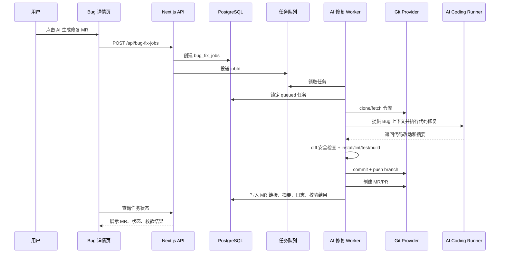

# Bug 管理接入 AI 自动修复 MR 技术方案

状态：待评审  
范围：AI PM 的 Bug 管理、项目仓库配置、任务执行系统、正式数据库持久化  
目标：从 Bug 记录自动生成代码修复分支、提交代码并创建 MR/PR，不自动合并

## 1. 目标

Bug 管理模块上线后需要具备生产可用的数据持久化和 AI 自动修复能力。系统从 Bug 详情页发起修复任务后，后台自动读取 Bug、版本、项目、附件和仓库配置，拉取代码，调用 AI Coding Runner 修改代码，运行校验，推送分支，并直接创建 MR/PR。

本方案不再使用 `.ai-pm/app-database.json` 或其他本地 JSON 文件承载业务数据。开发、测试、生产环境统一接入正式数据库。业务状态、任务日志、校验结果、MR 链接全部写入数据库。

本方案只做自动开 MR/PR，不做自动合并。合并仍由人工 Review、CI 和代码平台分支保护规则控制。

## 2. 非目标

- 不自动 merge 到主干。
- 不绕过 CI、Code Review、分支保护或人工审批。
- 不允许 AI 修改密钥、环境变量、CI 权限、部署凭据等高风险文件。
- 不允许 AI 只输出修改建议作为成功结果。
- 不把业务数据写入本地文件。
- 第一阶段不做跨多个仓库的联合修复。

## 3. 技术选型

### 数据库

- 正式数据库：PostgreSQL。
- ORM：Prisma。
- 连接方式：`DATABASE_URL`。
- 迁移方式：`prisma migrate`。
- 本地开发：连接开发库或 Docker PostgreSQL，不再写 `.ai-pm/app-database.json`。

### 后台任务

- API 只负责创建任务和查询任务。
- Worker 负责 clone、编码、校验、commit、push、创建 MR。
- Worker 执行目录只作为临时 checkout 工作区，不承载业务数据；执行结束清理或由保留策略清理。

### Git 平台

- 首期接 GitHub，UI 仍统一叫 MR。
- GitHub 实际创建 Pull Request。
- Git Provider 保持抽象，后续接 GitLab 时复用同一任务模型。

### AI Coding Runner

- 采用真实代码修改 Runner。
- Runner 必须产出代码 diff。
- 任务成功标准是创建 MR/PR 并回写链接。
- Runner 不能只生成排查建议；无法产生有效代码变更时任务失败。

## 4. 用户流程

1. 用户进入 Bug 详情页。
2. 点击 `AI 生成修复 MR`。
3. 系统展示确认抽屉：目标仓库、基准分支、允许修改目录、校验命令、Reviewer。
4. 用户确认后创建 AI 修复任务。
5. 后台 Worker 领取任务，拉取代码并创建 `ai-fix/*` 分支。
6. AI Coding Runner 基于 Bug 上下文直接修改代码。
7. Worker 检查 diff 权限，运行 install/lint/test/build。
8. Worker commit、push，并创建 MR/PR。
9. 系统把 MR 链接、修复摘要、改动文件、校验结果写回数据库。
10. Bug 自动流转为 `修复中`。
11. 人工 Review 和 CI 通过后合并，再由人工或 webhook 流转 Bug 到 `待验证` 或 `已关闭`。

## 5. 总体架构



## 6. 正式数据库设计

### 6.1 数据库基线

所有当前本地数据模型需要进入数据库。AI 修复 MR 功能依赖以下基础表：

| 表 | 用途 |
| --- | --- |
| `workspaces` | 工作区 |
| `workspace_members` | 工作区成员和权限 |
| `projects` | 项目 |
| `project_versions` | 需求版本 |
| `project_tasks` | 任务 |
| `bug_reports` | Bug 主表 |
| `bug_attachments` | Bug 附件 |
| `bug_flow_records` | Bug 流转记录 |
| `project_repositories` | 项目仓库配置 |
| `bug_fix_jobs` | AI 修复任务 |
| `bug_fix_job_logs` | AI 修复任务日志 |
| `bug_fix_job_checks` | AI 修复校验结果 |

### 6.2 项目仓库表

```prisma
model ProjectRepository {
  id                String   @id @default(cuid())
  workspaceId       String
  projectId         String?
  provider          GitProvider
  repoFullName      String
  cloneUrl          String
  defaultBranch     String   @default("main")
  packageManager    String   @default("pnpm")
  installCommand    String
  lintCommand       String?
  testCommand       String?
  buildCommand      String?
  allowedPaths      String[]
  blockedPaths      String[]
  defaultReviewers  String[]
  status            RepositoryStatus @default(active)
  createdAt         DateTime @default(now())
  updatedAt         DateTime @updatedAt

  workspace         Workspace @relation(fields: [workspaceId], references: [id])
  project           Project?  @relation(fields: [projectId], references: [id])
  bugFixJobs        BugFixJob[]

  @@index([workspaceId])
  @@index([projectId])
}

enum GitProvider {
  github
  gitlab
}

enum RepositoryStatus {
  active
  disabled
}
```

### 6.3 AI 修复任务表

```prisma
model BugFixJob {
  id              String   @id @default(cuid())
  workspaceId     String
  bugId           String
  repositoryId    String
  status          BugFixJobStatus @default(queued)
  baseBranch      String
  fixBranch       String?
  commitSha       String?
  mrUrl           String?
  mrNumber        String?
  mrState         String?
  summary         String?
  changedFiles    String[]
  error           String?
  requestedBy     String?
  createdAt       DateTime @default(now())
  updatedAt       DateTime @updatedAt
  startedAt       DateTime?
  finishedAt      DateTime?

  workspace       Workspace @relation(fields: [workspaceId], references: [id])
  bug             BugReport @relation(fields: [bugId], references: [id])
  repository      ProjectRepository @relation(fields: [repositoryId], references: [id])
  logs            BugFixJobLog[]
  checks          BugFixJobCheck[]

  @@index([workspaceId, status])
  @@index([bugId, createdAt])
  @@index([repositoryId])
}

model BugFixJobLog {
  id        String   @id @default(cuid())
  jobId     String
  level     JobLogLevel @default(info)
  message   String
  createdAt DateTime @default(now())

  job       BugFixJob @relation(fields: [jobId], references: [id], onDelete: Cascade)

  @@index([jobId, createdAt])
}

model BugFixJobCheck {
  id          String   @id @default(cuid())
  jobId       String
  name        String
  command     String
  status      CheckStatus
  durationMs  Int?
  outputTail  String?
  createdAt   DateTime @default(now())

  job         BugFixJob @relation(fields: [jobId], references: [id], onDelete: Cascade)

  @@index([jobId])
}

enum BugFixJobStatus {
  queued
  preparing
  analyzing
  coding
  testing
  pushing
  mr_created
  failed
  canceled
}

enum JobLogLevel {
  info
  warn
  error
}

enum CheckStatus {
  passed
  failed
  skipped
}
```

### 6.4 Bug 表扩展

`bug_reports` 增加最近一次 AI 修复摘要字段，用于列表和详情页快速展示：

```prisma
model BugReport {
  id                String   @id @default(cuid())
  // 既有字段省略
  aiFixLatestJobId  String?
  aiFixStatus       BugFixJobStatus?
  aiFixBranch       String?
  aiFixMrUrl        String?
  aiFixSummary      String?
  aiFixError        String?
  aiFixUpdatedAt    DateTime?

  bugFixJobs        BugFixJob[]
}
```

## 7. 后端模块

### 7.1 数据访问层

新增正式数据库访问模块：

```text
prisma/schema.prisma
prisma/migrations/
src/lib/db.ts
src/server/repositories/bugs.ts
src/server/repositories/projects.ts
src/server/repositories/project-repositories.ts
src/server/repositories/bug-fix-jobs.ts
```

所有 API 和 Worker 只通过 repository 层读写数据库，不直接操作 Prisma Client。

### 7.2 API

新增接口：

| Method | Path | 用途 |
| --- | --- | --- |
| POST | `/api/bug-fix-jobs` | 创建 AI 修复任务 |
| GET | `/api/bug-fix-jobs?bugId=xxx` | 查询某个 Bug 的修复任务 |
| GET | `/api/bug-fix-jobs/:jobId` | 查询任务详情 |
| POST | `/api/bug-fix-jobs/:jobId/cancel` | 取消未开始或可中断的任务 |

创建任务请求：

```json
{
  "bugId": "bug-xxx",
  "repositoryId": "repo-xxx",
  "baseBranch": "main",
  "extraPrompt": "优先检查登录态判断和接口返回兼容性",
  "runTests": true
}
```

创建任务时的数据库事务：

1. 校验用户权限。
2. 校验 Bug、项目、仓库同属一个 workspace。
3. 检查同一 Bug 是否已有 active job。
4. 插入 `bug_fix_jobs`。
5. 更新 `bug_reports.aiFix*` 快照字段。
6. 插入 `bug_flow_records`。
7. 投递队列消息。

### 7.3 Worker

新增模块：

```text
scripts/bug-fix-worker.ts
src/lib/bug-fix-jobs/context.ts
src/lib/bug-fix-jobs/runner.ts
src/lib/bug-fix-jobs/security.ts
src/lib/bug-fix-jobs/mr-template.ts
src/lib/git-providers/types.ts
src/lib/git-providers/github.ts
```

Worker 步骤：

1. 领取任务并使用数据库行锁或原子状态更新将任务置为 `preparing`。
2. 创建临时 checkout 目录。
3. clone 仓库并 checkout 基准分支。
4. 创建分支：`ai-fix/{bugId}-{slug}`。
5. 拼装 Bug 上下文，包含标题、描述、复现步骤、附件索引、版本、项目、负责人、历史流转记录。
6. 调用 AI Coding Runner 修改代码。
7. 检查 diff 是否越权。
8. 执行 install/lint/test/build。
9. commit。
10. push。
11. 调 Git Provider 创建 MR/PR。
12. 回写 `bug_fix_jobs`、`bug_fix_job_logs`、`bug_fix_job_checks` 和 `bug_reports.aiFix*`。

状态流转：

```text
queued -> preparing -> analyzing -> coding -> testing -> pushing -> mr_created
                                                  -> failed
```

## 8. AI Coding Runner

统一接口：

```ts
export type AiCodeRunnerInput = {
  workspaceDir: string;
  bug: BugReport;
  repository: ProjectRepository;
  extraPrompt?: string;
};

export type AiCodeRunnerResult = {
  summary: string;
  changedFiles: string[];
  riskNotes: string[];
};
```

Runner 规则：

- 必须直接修改 checkout 工作区代码。
- 必须产出至少一个允许范围内的代码 diff。
- 不允许只输出排查建议、修改意见或伪日志。
- 无有效 diff 时任务置为 `failed`。
- diff 越权时任务置为 `failed`，不 push。
- 校验通过后创建 Ready MR/PR。
- 校验失败但已有有效代码 diff 时创建 Draft MR/PR，并在 MR body 写入失败命令、失败日志和风险说明。

环境变量：

```bash
AI_BUG_FIX_RUNNER=local-command
AI_BUG_FIX_RUNNER_COMMAND="codex exec --json"
AI_BUG_FIX_WORKDIR=/tmp/ai-pm-bug-fix-workspaces
```

## 9. Git Provider

接口：

```ts
export type CreateMergeRequestInput = {
  repoFullName: string;
  sourceBranch: string;
  targetBranch: string;
  title: string;
  body: string;
  reviewers?: string[];
  draft?: boolean;
};

export type GitProviderClient = {
  createMergeRequest(input: CreateMergeRequestInput): Promise<{
    url: string;
    number: string;
  }>;
};
```

MR 标题：

```text
fix: 修复 {bug.title}
```

分支命名：

```text
ai-fix/{bugId}-{titleSlug}
```

MR body 模板：

```md
## Bug
- 标题：
- 严重程度：
- 环境：
- 复现步骤：

## AI 修复摘要

## 改动文件

## 校验结果

## 风险与人工 Review 重点

由 AI PM 自动生成，请人工 Review 后合并。
```

## 10. 安全边界

必须执行：

- 仓库必须来自 `project_repositories` 白名单。
- 分支只能创建到 `ai-fix/*`。
- 禁止 push 到默认分支。
- 禁止自动合并。
- 禁止修改 `.env`、密钥、证书、CI 权限、部署脚本等文件。
- 限制最大改动文件数，例如 20 个。
- 限制最大 diff 行数，例如 1500 行。
- 所有执行日志写入 `bug_fix_job_logs`。
- 所有校验结果写入 `bug_fix_job_checks`。
- Worker 临时 checkout 目录不保存业务状态，任务结束后清理。

默认 blockedPaths：

```ts
[
  ".env",
  ".env.*",
  "**/*.pem",
  "**/*.key",
  ".github/workflows/**",
  ".gitlab-ci.yml",
  "Dockerfile",
  "deploy/**",
  "infra/**"
]
```

## 11. UI 展示

### 组件文件规范

本次功能涉及的新增或重构组件必须遵守全项目组件目录规范：

```text
component-name/
  index.tsx
  index.less
```

执行要求：

- Bug AI 修复卡片、确认抽屉、任务状态标签等新增组件全部使用目录组件。
- 如果改造既有 Bug 详情页或 Bug 列表页时发生组件拆分，同步迁移到 `index.tsx` + `index.less`。
- 组件样式放在同目录 `index.less`，不继续堆到全局样式文件。

### Bug 详情页

新增侧边卡片：`AI 修复 MR`

展示内容：

- 当前状态
- 分支名
- MR 链接
- 修复摘要
- 改动文件
- 校验结果
- 失败原因
- 最近日志

按钮：

- `AI 生成修复 MR`
- `查看 MR`
- `重新生成`
- `取消任务`

### Bug 列表

在操作区或状态区展示：

- `AI 修复中`
- `MR 已创建`
- `修复失败`

## 12. 数据回写

创建任务时：

- `bug_reports.aiFixStatus = queued`
- `bug_reports.aiFixLatestJobId = job.id`
- 新增 `bug_flow_records`，note 为 `创建 AI 修复 MR 任务`

MR 创建成功时：

- `bug_fix_jobs.status = mr_created`
- `bug_fix_jobs.mrUrl = mr.url`
- `bug_fix_jobs.summary = runner.summary`
- `bug_reports.aiFixStatus = mr_created`
- `bug_reports.aiFixMrUrl = mr.url`
- `bug_reports.aiFixSummary = runner.summary`
- Bug 当前状态为 `新建` 或 `定位中` 时自动改为 `修复中`

任务失败时：

- `bug_fix_jobs.status = failed`
- `bug_fix_jobs.error = error.message`
- `bug_reports.aiFixStatus = failed`
- `bug_reports.aiFixError = error.message`
- Bug 状态不自动回退

## 13. 文件改动规划

```text
package.json
prisma/schema.prisma
prisma/migrations/
src/lib/db.ts
src/server/repositories/
app/api/bug-fix-jobs/route.ts
app/api/bug-fix-jobs/[jobId]/route.ts
app/api/bug-fix-jobs/[jobId]/cancel/route.ts
src/lib/bug-fix-jobs/
src/lib/git-providers/
src/components/project-management-platform/views/bug-route-edit-view/index.tsx
src/components/project-management-platform/views/bug-route-edit-view/index.less
src/components/project-management-platform/views/bugs-view/index.tsx
src/components/project-management-platform/views/bugs-view/index.less
src/components/project-management-platform/forms/bug-ai-fix-drawer/index.tsx
src/components/project-management-platform/forms/bug-ai-fix-drawer/index.less
src/components/project-management-platform/shared/bug-ai-fix-card/index.tsx
src/components/project-management-platform/shared/bug-ai-fix-card/index.less
src/components/project-management-platform/shared/bug-ai-fix-status/index.tsx
src/components/project-management-platform/shared/bug-ai-fix-status/index.less
scripts/bug-fix-worker.ts
```

## 14. 上线分期

### M1：数据库基线

- 引入 Prisma 和 PostgreSQL。
- 建立基础业务表、仓库配置表、AI 修复任务表。
- API 从数据库读取 Bug、项目、版本、任务和成员。
- 本地 JSON 只允许作为一次性迁移来源，运行态不再读写。

验收：

- `DATABASE_URL` 指向开发库时，应用可完整读写 Bug、任务、版本和项目。
- 创建、编辑、查询 Bug 不再依赖 `.ai-pm/app-database.json`。

### M2：仓库配置与 Bug 入口

- 增加项目仓库配置管理。
- Bug 详情展示 AI 修复 MR 卡片。
- 点击按钮创建 `bug_fix_jobs`。

验收：

- Bug 能匹配目标仓库。
- 同一 Bug 同时只能存在一个 active AI 修复任务。

### M3：Worker 与真实代码修复

- Worker 从数据库领取任务。
- Worker 调用 AI Coding Runner 修改代码。
- Worker 执行 diff 安全检查和校验命令。

验收：

- Runner 无有效 diff 时任务失败。
- Runner 有有效 diff 时进入 push/MR 创建流程。

### M4：自动创建 MR/PR

- Worker commit、push `ai-fix/*` 分支。
- GitHub Provider 创建 PR。
- PR 链接回写 Bug。

验收：

- Bug 详情出现可点击 MR 链接。
- MR body 包含 Bug 信息、修复摘要、改动文件、校验结果。
- 校验失败但已有有效 diff 时创建 Draft MR。

### M5：通知与闭环

- MR 创建后通知负责人。
- 接入代码平台 webhook，同步 MR merged/closed 状态。
- 合并后辅助流转 Bug 到 `待验证`。

验收：

- MR 状态变化能回写 Bug。
- Bug 流转记录能看到 AI 修复任务、MR 链接和合并结果。

## 15. 环境变量

```bash
DATABASE_URL=
GITHUB_TOKEN=
AI_BUG_FIX_ENABLED=false
AI_BUG_FIX_WORKDIR=/tmp/ai-pm-bug-fix-workspaces
AI_BUG_FIX_RUNNER=local-command
AI_BUG_FIX_RUNNER_COMMAND=
AI_BUG_FIX_MAX_CHANGED_FILES=20
AI_BUG_FIX_MAX_DIFF_LINES=1500
```

默认 `AI_BUG_FIX_ENABLED=false`，未配置数据库、仓库和 token 时不允许触发。

## 16. 风险与应对

| 风险 | 应对 |
| --- | --- |
| AI 修错代码 | 只开 MR，不自动合并；必须人工 Review |
| 修改越权文件 | allowedPaths/blockedPaths + diff 检查 |
| 长任务阻塞 API | Worker 异步执行，不在 API route 直接跑 |
| 凭据泄漏 | token 只在 Worker 环境读取，不写入日志 |
| 测试耗时太长 | 命令超时限制，失败回写 |
| 多人重复触发 | 同一 Bug 同一时间只允许一个 active job |
| 数据不一致 | API 创建任务使用数据库事务；Worker 状态更新使用原子条件更新 |
| 代码平台差异 | GitProvider 抽象，首期 GitHub，后续 GitLab |

## 17. 结论

上线实现路径确定为：`正式 PostgreSQL 数据库 -> Bug 详情页创建 AI 修复任务 -> Worker 调用 AI 修改代码 -> commit/push -> 创建 MR/PR -> 回写 Bug`。

该功能的成功结果必须是 MR/PR 链接，不接受只生成修改建议作为完成状态。
