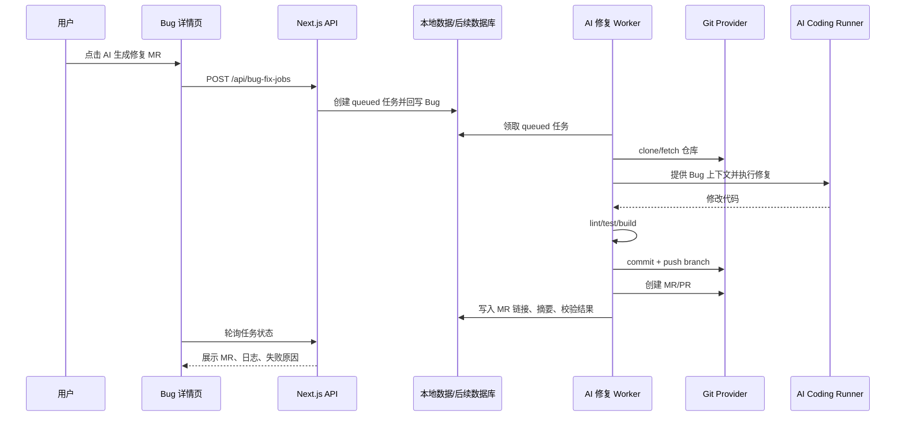

# Bug 管理接入 AI 自动修复 MR 技术方案

状态：待评审  
范围：AI PM 的 Bug 管理模块  
目标：从 Bug 记录自动生成代码修复分支和 MR/PR，不自动合并

## 1. 背景与目标

当前 Bug 管理已经具备 Bug 录入、版本关联、负责人、复现材料、状态流转和通知能力。下一步希望在 Bug 详情页增加 `AI 生成修复 MR` 能力，让系统基于 Bug 信息自动拉取项目代码、定位问题、修改代码、执行校验并创建 MR。

本方案只做“自动开 MR”，不做“自动合并”。合并仍由人工 Review 和代码平台保护分支规则决定。

## 2. 非目标

- 不自动 merge 到主干。
- 不绕过 CI、Code Review、分支保护或人工审批。
- 不允许 AI 修改密钥、环境变量、CI 权限、部署凭据等高风险文件。
- 第一版不做跨多个仓库的联合修复。
- 第一版不承诺 100% 自动修复成功，失败时要产出排查建议。

## 3. 用户流程

1. 用户进入 Bug 详情页。
2. 点击 `AI 生成修复 MR`。
3. 系统展示确认抽屉：目标仓库、基准分支、允许修改目录、校验命令、Reviewer。
4. 用户确认后创建 AI 修复任务。
5. 后台 worker 拉取代码、创建分支、调用 AI 修复、运行校验。
6. 校验通过后提交 commit、推送分支、创建 MR/PR。
7. 系统把 MR 链接、修复摘要、校验结果回写到 Bug。
8. Bug 状态流转为 `修复中` 或 `待验证`，具体由配置决定。
9. 人工 Review，合并后再由 CI webhook 或人工操作流转 Bug。

## 4. 总体架构



## 5. 模块拆分

### 5.1 Bug 页面入口

改动位置：

- `src/components/project-management-platform/views/bug-route-edit-view.tsx`
- `src/components/project-management-platform/views/bugs-view.tsx`
- `src/components/project-management-platform.tsx`

新增能力：

- Bug 详情页增加 `AI 生成修复 MR` 按钮。
- 列表页可增加轻量状态标签：`AI 修复中`、`MR 已创建`、`修复失败`。
- 点击按钮后打开确认抽屉，避免误触后直接开始执行。

确认抽屉字段：

| 字段 | 说明 |
| --- | --- |
| 目标仓库 | 根据 Bug 的项目自动匹配，可手动调整 |
| 基准分支 | 默认来自仓库配置，如 `main` |
| 修复范围 | 展示允许修改目录和禁止修改目录 |
| 校验命令 | 展示 install/lint/test/build |
| Reviewer | 默认来自项目配置 |
| 附加提示 | 用户可补充复现信息或约束 |

### 5.2 项目仓库配置

第一版不要把仓库配置塞进 `Project` 本体，建议独立成 `ProjectRepository`，便于一个项目后续绑定多个仓库。

新增类型建议放在 `src/types/dashboard.ts`：

```ts
export type GitProvider = "github" | "gitlab";

export type ProjectRepository = {
  id: string;
  workspaceId: string;
  projectName: string;
  provider: GitProvider;
  repoFullName: string; // owner/repo 或 group/project
  cloneUrl: string;
  defaultBranch: string;
  packageManager: "pnpm" | "npm" | "yarn";
  installCommand: string;
  lintCommand?: string;
  testCommand?: string;
  buildCommand?: string;
  allowedPaths: string[];
  blockedPaths: string[];
  defaultReviewers: string[];
  status: "active" | "disabled";
  createdAt: string;
  updatedAt: string;
};
```

本地数据扩展：

- `.ai-pm/app-database.json` 增加 `repositories: ProjectRepository[]`。
- `src/data/local-dashboard.ts` 增加 normalize 和读写兼容。
- 后续如果接数据库，迁移为单独表。

### 5.3 AI 修复任务模型

新增 `BugFixJob`，用于记录后台执行过程，不直接塞进 Bug 的流转记录里。

```ts
export type BugFixJobStatus =
  | "queued"
  | "preparing"
  | "analyzing"
  | "coding"
  | "testing"
  | "pushing"
  | "mr_created"
  | "failed"
  | "canceled";

export type BugFixCheckResult = {
  name: "install" | "lint" | "test" | "build" | "custom";
  command: string;
  status: "passed" | "failed" | "skipped";
  durationMs?: number;
  outputTail?: string;
};

export type BugFixJob = {
  id: string;
  workspaceId: string;
  bugId: string;
  repositoryId: string;
  status: BugFixJobStatus;
  baseBranch: string;
  fixBranch?: string;
  commitSha?: string;
  mrUrl?: string;
  mrNumber?: string;
  summary?: string;
  changedFiles?: string[];
  checks: BugFixCheckResult[];
  error?: string;
  logs: string[];
  requestedBy?: string;
  createdAt: string;
  updatedAt: string;
  startedAt?: string;
  finishedAt?: string;
};
```

Bug 本体只保留最近一次 AI 修复摘要字段，方便列表展示：

```ts
export type BugAiFixBrief = {
  latestJobId?: string;
  status?: BugFixJobStatus;
  branch?: string;
  mrUrl?: string;
  summary?: string;
  testResult?: string;
  error?: string;
  updatedAt?: string;
};
```

`BugReport` 增加：

```ts
aiFix?: BugAiFixBrief;
```

### 5.4 API 设计

新增目录：

- `app/api/bug-fix-jobs/route.ts`
- `app/api/bug-fix-jobs/[jobId]/route.ts`
- `app/api/bug-fix-jobs/[jobId]/cancel/route.ts`

接口：

| Method | Path | 用途 |
| --- | --- | --- |
| POST | `/api/bug-fix-jobs` | 创建 AI 修复任务 |
| GET | `/api/bug-fix-jobs?bugId=xxx` | 查询某个 Bug 的修复任务 |
| GET | `/api/bug-fix-jobs/:jobId` | 查询任务详情 |
| POST | `/api/bug-fix-jobs/:jobId/cancel` | 取消未执行或执行中的任务 |

创建任务请求：

```json
{
  "bugId": "bug-xxx",
  "repositoryId": "repo-xxx",
  "baseBranch": "main",
  "extraPrompt": "优先检查登录态判断和接口返回兼容性",
  "runTests": true
}
```

创建任务响应：

```json
{
  "job": {
    "id": "bugFixJob-xxx",
    "status": "queued"
  },
  "message": "已创建 AI 修复任务"
}
```

权限：

- `canEditBugs` 才能创建任务。
- `viewer` 禁止创建任务。
- 第一版建议只有 `owner/admin/productAdmin` 可配置仓库。

### 5.5 Worker 设计

不要在 Next.js API route 内直接执行 clone、AI 编码、测试和 push。这些是长任务，应该由 worker 执行。

第一版可做本地 worker：

- `scripts/bug-fix-worker.ts`
- `pnpm bug-fix:worker`
- 轮询本地 `bugFixJobs` 中的 `queued` 任务。

后续可替换为：

- BullMQ + Redis
- GitHub Actions runner
- 自建容器任务
- Kubernetes Job

Worker 步骤：

1. 领取任务并置为 `preparing`。
2. 创建隔离目录：`.ai-pm/bug-fix-workspaces/{jobId}`。
3. clone 仓库并 checkout 基准分支。
4. 创建分支：`ai-fix/{bugId}-{slug}`。
5. 拼装 Bug 上下文。
6. 调用 AI Coding Runner 修改代码。
7. 检查 diff 是否越权。
8. 执行 install/lint/test/build。
9. commit。
10. push。
11. 调 Git Provider 创建 MR。
12. 回写 job 和 bug。

状态流转：

```text
queued -> preparing -> analyzing -> coding -> testing -> pushing -> mr_created
                                                  -> failed
```

### 5.6 AI Coding Runner

为避免把 AI 工具绑定死，定义统一接口：

```ts
export type AiCodeRunnerInput = {
  workspaceDir: string;
  bug: BugReport;
  repository: ProjectRepository;
  extraPrompt?: string;
};

export type AiCodeRunnerResult = {
  summary: string;
  changedFiles: string[];
  riskNotes: string[];
};
```

第一版 runner 建议做成可插拔：

- `localCommandRunner`：通过环境变量配置本地命令，例如 Codex CLI 或其他内部编码 agent。
- `dryRunRunner`：只生成排查建议，不改代码，用于验证链路。
- `openAiPatchRunner`：后续再做，负责生成 patch 并由 worker 应用。

环境变量：

```bash
AI_BUG_FIX_RUNNER=local-command
AI_BUG_FIX_RUNNER_COMMAND="codex exec --json"
AI_BUG_FIX_WORKDIR=.ai-pm/bug-fix-workspaces
```

第一版可以先落 `dryRunRunner + GitHub PR skeleton`，再接真实 coding runner，这样链路可逐步验证。

### 5.7 Git Provider 设计

新增目录：

- `src/lib/git-providers/types.ts`
- `src/lib/git-providers/github.ts`
- `src/lib/git-providers/gitlab.ts` 后置

接口：

```ts
export type CreateMergeRequestInput = {
  repoFullName: string;
  sourceBranch: string;
  targetBranch: string;
  title: string;
  body: string;
  reviewers?: string[];
};

export type GitProviderClient = {
  createMergeRequest(input: CreateMergeRequestInput): Promise<{
    url: string;
    number: string;
  }>;
};
```

第一版优先 GitHub：

- UI 仍叫 MR。
- GitHub 实际创建 Pull Request。
- 环境变量：`GITHUB_TOKEN`。
- token 权限：repo read/write、pull request write。

MR 标题：

```text
fix: 修复 {bug.title}
```

分支命名：

```text
ai-fix/{bugId}-{titleSlug}
```

MR body 模板：

```md
## Bug
- 标题：
- 严重程度：
- 环境：
- 复现步骤：

## AI 修复摘要

## 改动文件

## 本地校验

## 风险与待确认

由 AI PM 自动生成，请人工 Review 后合并。
```

### 5.8 安全与边界控制

必须做：

- 仓库必须来自项目配置白名单。
- 分支只能创建到 `ai-fix/*`。
- 禁止 push 到默认分支。
- 禁止自动合并。
- 禁止修改 `.env`、密钥、证书、CI 权限、部署脚本等文件。
- 限制最大改动文件数，例如 20 个。
- 限制最大 diff 行数，例如 1500 行。
- 校验命令失败则不创建 MR，或创建 Draft MR，具体由配置决定。
- 所有执行日志写入 `BugFixJob.logs`。
- Worker 工作区每次独立，避免污染主应用仓库。

默认 blockedPaths：

```ts
[
  ".env",
  ".env.*",
  "**/*.pem",
  "**/*.key",
  ".github/workflows/**",
  ".gitlab-ci.yml",
  "Dockerfile",
  "deploy/**",
  "infra/**"
]
```

如果确实需要改 CI 或部署文件，必须人工处理，不走 AI 自动修复。

## 6. UI 展示细节

### Bug 详情页

新增侧边卡片：`AI 修复 MR`

展示内容：

- 当前状态
- 分支名
- MR 链接
- 修复摘要
- 校验结果
- 失败原因
- 最近日志

按钮：

- `AI 生成修复 MR`
- `查看 MR`
- `重新生成`
- `取消任务`

### Bug 列表

新增一列或在操作区展示：

- `AI 修复中`
- `MR 已创建`
- `失败`

第一版建议只在详情页做完整状态，列表只做轻量标签，避免表格过宽。

## 7. 数据回写策略

创建任务时：

- `Bug.aiFix.status = queued`
- `Bug.aiFix.latestJobId = job.id`
- 增加一条 flow record：`updated`，note 为 `创建 AI 修复任务`

MR 创建成功时：

- `Bug.aiFix.status = mr_created`
- `Bug.aiFix.mrUrl = job.mrUrl`
- `Bug.aiFix.summary = job.summary`
- 如果 Bug 当前状态是 `新建` 或 `定位中`，自动改为 `修复中`
- 不自动改为 `待验证`，除非项目配置允许“MR 创建即待验证”

任务失败时：

- `Bug.aiFix.status = failed`
- `Bug.aiFix.error = job.error`
- Bug 状态不自动回退

## 8. 文件改动规划

第一阶段建议改动：

```text
src/types/dashboard.ts
src/data/local-dashboard.ts
app/api/bug-fix-jobs/route.ts
app/api/bug-fix-jobs/[jobId]/route.ts
app/api/bug-fix-jobs/[jobId]/cancel/route.ts
src/lib/bug-fix-jobs/
src/lib/git-providers/
src/components/project-management-platform/views/bug-route-edit-view.tsx
src/components/project-management-platform/views/bugs-view.tsx
src/components/project-management-platform/forms/
scripts/bug-fix-worker.ts
package.json
```

建议新增模块：

```text
src/lib/bug-fix-jobs/context.ts      # 拼装 Bug + 附件 + 仓库配置上下文
src/lib/bug-fix-jobs/queue.ts        # 本地任务领取和状态更新
src/lib/bug-fix-jobs/runner.ts       # AI runner 抽象
src/lib/bug-fix-jobs/security.ts     # diff 和路径安全检查
src/lib/bug-fix-jobs/mr-template.ts  # MR body 模板
```

## 9. MVP 分期

### M1：仓库配置与任务模型

- 增加 `ProjectRepository`、`BugFixJob` 类型。
- 本地数据读写兼容。
- 仓库配置先用静态表或本地数据维护。
- Bug 详情展示 AI 修复卡片空状态。

验收：

- 可以给项目配置仓库。
- 可以在 Bug 详情看到目标仓库。

### M2：创建任务与状态展示

- 增加 `POST /api/bug-fix-jobs`。
- Bug 详情页按钮和确认抽屉。
- 创建 job 后回写 Bug。
- 前端轮询 job 状态。

验收：

- 点击按钮后生成 queued job。
- Bug 上能看到 `AI 修复中`。

### M3：Worker Dry Run

- Worker 能领取任务。
- 拼装上下文。
- 不改代码，只生成排查建议和模拟日志。
- 状态能从 queued 跑到 failed 或 completed dry-run。

验收：

- 链路可跑通。
- 失败原因能展示。

### M4：GitHub PR 创建

- Worker clone 仓库。
- 创建分支。
- 生成空 commit 或文档 commit。
- 创建 GitHub PR。
- 回写 PR 链接。

验收：

- Bug 自动出现 MR 链接。
- 分支和 PR 标题符合规范。

### M5：接入真实 AI Coding Runner

- 调用 AI runner 修改代码。
- 做路径和 diff 安全检查。
- 执行 install/lint/test/build。
- 校验通过后创建 MR。

验收：

- 简单 Bug 可以自动开带代码变更的 MR。
- 校验失败时不静默成功，能显示失败命令和日志。

## 10. 环境变量

```bash
GITHUB_TOKEN=
AI_BUG_FIX_ENABLED=false
AI_BUG_FIX_WORKDIR=.ai-pm/bug-fix-workspaces
AI_BUG_FIX_RUNNER=dry-run
AI_BUG_FIX_RUNNER_COMMAND=
AI_BUG_FIX_MAX_CHANGED_FILES=20
AI_BUG_FIX_MAX_DIFF_LINES=1500
```

默认 `AI_BUG_FIX_ENABLED=false`，避免未配置仓库和 token 时误触发。

## 11. 风险与应对

| 风险 | 应对 |
| --- | --- |
| AI 修错代码 | 只开 MR，不自动合并；必须人工 Review |
| 修改越权文件 | allowedPaths/blockedPaths + diff 检查 |
| 长任务阻塞 API | Worker 异步执行，不在 API route 直接跑 |
| 凭据泄漏 | token 只在 worker 环境读取，不写入日志 |
| 测试耗时太长 | 命令超时限制，失败回写 |
| 多人重复触发 | 同一 Bug 同一时间只允许一个 active job |
| 代码平台差异 | GitProvider 抽象，先 GitHub 后 GitLab |

## 12. 待确认问题

1. 第一版代码平台先接 GitHub 还是 GitLab？
2. 项目和仓库是一对一还是一对多？
3. MR 创建后 Bug 状态应该变成 `修复中` 还是 `待验证`？
4. 校验失败时是否允许创建 Draft MR？
5. AI runner 使用本地命令、远程服务，还是后续单独部署 runner？
6. 是否需要把 AI 修复日志通知到飞书？

## 13. 推荐结论

建议第一版目标定为：`Bug 详情页 -> AI 生成修复 MR -> GitHub PR 链接回写`。先把仓库配置、任务模型、异步 worker、Git provider 和 UI 状态闭环搭起来，再接真实 AI coding runner。这样风险最低，也方便后续替换 GitLab、CI webhook 或更强的代码修复模型。
