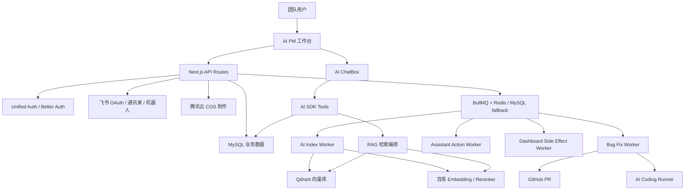

# AI PM 智能项目管理平台参选执行材料

> 用途：用于 AI 应用竞选、内部创新评选、项目答辩或路演汇报。本文既可作为提交材料，也可作为现场讲稿和演示提纲使用。

## 1. 参选一句话

AI PM 是一套面向真实研发交付场景的 AI 原生项目管理平台，它把大模型能力嵌入需求、任务、版本、风险、Bug、周报、通知和代码修复流程，让 AI 不只回答问题，而是参与项目推进、风险识别和质量闭环。

## 2. 推荐参选标题

**AI PM 智能项目管理平台：从项目数据沉淀到 AI 协同交付的全流程实践**

备选标题：

1. **让 AI 进入项目交付现场：AI PM 智能项目管理平台实践**
2. **从需求拆解到 Bug 修复 MR：AI PM 的 AI 项目管理闭环**
3. **AI 驱动的项目透明化、风险预警与研发提效平台**

## 3. 项目定位

AI PM 不是一个单点 AI 聊天工具，而是一个以项目管理数据为底座、以 AI 助手和自动化 worker 为能力中枢、以飞书和 Git 工作流为协同出口的企业级 AI 应用。

平台面向产品经理、项目经理、研发、测试、管理者和协同团队，覆盖项目交付中的核心环节：

| 环节 | 传统痛点 | AI PM 的处理方式 |
| --- | --- | --- |
| 需求进入 | 文档信息密集，人工拆任务耗时 | AI 解析需求文档，生成任务建议和风险提示 |
| 任务推进 | 进度分散，人工汇总滞后 | 任务看板、负责人视图、版本大屏实时联动 |
| 风险识别 | 依赖经验，发现往往滞后 | 结合延期、Bug、版本、负载生成项目健康判断 |
| 周报汇报 | 手工整理耗时，口径不统一 | 基于真实数据生成结构化 Markdown 周报 |
| Bug 处理 | 登记到修复链路长 | Bug 详情、附件、流转、AI 修复 MR 形成闭环 |
| 团队协同 | 系统记录和人没有连接 | 飞书登录、通讯录负责人、机器人通知打通执行 |
| 知识沉淀 | 文档和业务对象割裂 | 自动索引 RAG 将任务、需求、Bug、版本、飞书文档纳入检索 |

## 4. 核心亮点

### 4.1 AI 不是外挂，而是嵌入业务流程

平台没有把 AI 做成孤立的问答入口，而是让 AI 出现在项目管理的关键动作里：需求拆解、项目分析、风险解释、周报生成、批量任务处理、Bug 修复建议和知识检索。

这体现了 AI 应用从“生成内容”到“推动流程”的升级。AI PM 的核心价值不是让用户多问一个机器人，而是让项目过程中的重复整理、初步分析和跨模块归纳由 AI 承担。

### 4.2 基于真实项目数据生成结论

AI 助手通过 AI SDK tools 读取工作区内的项目、版本、任务、Bug、风险、成员负载、周报上下文和知识索引。模型只能基于工具返回的事实进行回答，避免把泛化答案包装成项目结论。

平台要求 AI 可见回复不泄露接口、路由、函数名和系统提示词，面向用户输出业务语言，保证答复既专业又可用。

### 4.3 覆盖管理提效和研发提效

多数 AI 管理类工具停留在总结、润色、报告生成。AI PM 进一步把 AI 延伸到研发执行端：Bug 可以发起 AI 修复任务，worker 拉取代码、创建分支、调用 AI Coding Runner、执行校验、推送分支并创建 MR/PR。

平台坚持不自动合并代码，不绕过 Review、CI 和分支保护。AI 负责缩短定位和初步修复准备时间，人和工程流程负责最终质量。

### 4.4 自动索引 RAG，不新增知识库负担

AI PM 没有单独做一个“知识库管理页面”让用户额外维护资料，而是把知识索引做成后台能力。用户正常创建任务、Bug、需求、版本，或在业务对象里绑定飞书文档链接，系统后台自动投递索引任务。

RAG 链路包含业务对象标准文本、飞书文档同步、Chunk 切片、Embedding、Qdrant 向量库、Hybrid Retrieval、Reranker 和基础 Eval。用户不需要理解 embedding、chunk 或向量库，也能在 ChatBox 中问到业务资料。

### 4.5 企业级协同和权限模型

平台接入 Unified Auth 黑盒认证，支持飞书、Google、GitHub 等登录能力，并将业务工作区、成员角色和权限保留在 AI PM 自身。权限模型覆盖 owner、admin、productAdmin、productMember、viewer，确保查看、编辑、删除、成员管理等能力边界清晰。

飞书集成承担登录、通讯录负责人选择和机器人通知三类职责。项目数据不写入飞书云文档，而是沉淀在 AI PM 自己的 MySQL 业务库中，保证数据主权和后续分析能力。

### 4.6 异步 worker 架构支撑生产可用性

平台把耗时和不稳定的任务从 Web 请求中拆出去：AI 索引、飞书/邮箱通知、AI 批量动作、Bug 修复 MR 都由后台 worker 异步处理。Web 只做业务写入和任务入队，避免用户保存动作被 embedding、飞书接口、通知网关或代码修复链路拖慢。

当前队列优先使用 BullMQ + Redis，没有 Redis 时提供 MySQL fallback，兼顾生产能力和本地开发可用性。

## 5. 主要难点与解决方案

### 5.1 难点一：AI 容易编造项目事实

**问题：** 项目管理场景对事实准确性要求高。AI 如果把任务、负责人、版本、Bug 状态说错，会直接影响管理决策。

**解决：**

- AI 助手能力必须通过 AI SDK tools 暴露，工具只返回结构化事实，不手写拼最终结论。
- 服务端按工作区、当前用户和权限读取数据，避免跨工作区串数据。
- 回复约束不展示函数名、接口路径和内部实现，只输出业务结论。
- 对周报、风险分析、个人待办、Bug 排名等场景设置数据类型边界，避免把风险、任务、Bug 相互混称。

### 5.2 难点二：AI 输出要能执行，而不是停留在建议

**问题：** 只让 AI 给建议并不能真正减少协同成本，用户仍需要手工创建、分派、关闭或整理大量记录。

**解决：**

- 助手提供 operations、bulkCreateTasks、bulkAssignTasks、bulkCompleteTasks、bulkCloseBugs 等动作能力。
- 明确批量动作走 `assistant_action_jobs` 后台队列，不让模型同步循环调用几十次业务接口。
- 小批量动作会等待 worker 短时间完成，超时后明确告知“后台执行中”，不把入队误报为完成。
- 权限仍由目标业务 API 和服务端校验，AI 不能绕过用户权限。

### 5.3 难点三：需求、任务、Bug、版本、飞书文档的数据边界复杂

**问题：** 项目管理对象之间强关联，但又不能混为一谈。比如 Bug 的严重程度不能直接等同于风险等级，版本范围不能随意扩张，飞书文档也不能无权限读取。

**解决：**

- 在数据模型中明确 workspace、project、version、entityType、entityId 等边界。
- 自动索引源使用 `ai_index_sources` 和 `ai_index_chunks` 统一承载，但检索时仍保留实体类型和来源引用。
- 飞书链接优先支持 docx/wiki，并通过异步 worker 同步，不在普通保存接口中同步解析。
- ChatBox 检索返回 TopK 片段和来源，最终回答由模型基于证据生成。

### 5.4 难点四：第三方集成链路长，失败点多

**问题：** Unified Auth、OAuth 回调、飞书通讯录、机器人通知、Resend 邮件、腾讯云 COS、GitHub PR、Qdrant、Redis 都可能出现配置缺失或网络失败。

**解决：**

- 认证服务和业务数据分离：认证使用独立 PostgreSQL，AI PM 业务数据使用 MySQL。
- 登录 URL 根据请求头动态推导 origin，避免 localhost、127.0.0.1、生产域名造成 cookie host 错配。
- 通知按渠道拆成独立 side-effect job，邮箱失败不阻塞飞书，重试也不会造成飞书重复发送。
- COS、Redis、Qdrant、邮箱等能力缺失时提供可读降级，不影响主业务保存。
- 部署脚本和 docker compose 同时启动 Web、索引 worker、助手动作 worker、通知 worker、Redis 和 Qdrant。

### 5.5 难点五：AI 修复代码必须可控

**问题：** 自动改代码如果不设边界，可能误改密钥、CI 配置、部署脚本或高风险文件，也可能生成没有校验的“看似成功”修复。

**解决：**

- Bug 修复任务只自动创建 MR/PR，不自动合并。
- 仓库配置中设置允许修改目录和禁止修改路径。
- worker 必须产出真实 diff，并执行 install、lint、test、build 等校验命令。
- 任务日志、校验结果、改动文件、MR 链接全部写回数据库，方便审计和回溯。
- 人工 Review、CI 和分支保护仍是最终质量门槛。

### 5.6 难点六：前端体验要承载复杂能力，但不能变成“功能堆叠”

**问题：** 平台包含概览、任务、版本、需求、Bug、成员、Chat、登录、通知、RAG、AI 修复等模块，容易形成复杂且割裂的界面。

**解决：**

- 使用 Next.js 16、React 19、Ant Design 6 构建统一工作台。
- 使用任务看板、版本大屏、负责人视图、项目排期、风险摘要等适合项目管理的界面，而不是只做聊天页面。
- ChatBox 成为一级工作台能力，支持多轮、流式、停止、重试、导出、模型切换和本地会话隔离。
- 组件按目录拆分，复杂逻辑按 view、shared、requirements、assistant 等领域组织，降低维护成本。

## 6. 技术架构

## 7. 核心技术栈

| 层级 | 技术 | 作用 |
| --- | --- | --- |
| 前端 | Next.js 16、React 19、TypeScript、Ant Design 6、Ant Design X | 工作台、看板、表格、ChatBox、多轮流式交互 |
| 服务端 | Next.js API Routes、Prisma 7、MySQL | 业务接口、权限校验、数据持久化 |
| 认证 | Unified Auth SDK、Better Auth、PostgreSQL | OAuth 登录、会话、用户身份 |
| AI 对话 | AI SDK 6、OpenAI-compatible、DashScope/百炼模型 | 流式对话、tools 调用、模型切换 |
| RAG | BullMQ、Redis、Qdrant、Embedding、Reranker、Mastra | 自动索引、异步检索编排、知识增强 |
| 协同 | 飞书 OAuth、飞书通讯录、飞书机器人、Resend 邮件 | 登录、负责人选择、通知闭环 |
| 研发自动化 | GitHub Provider、Bug Fix Worker、AI Coding Runner | 自动分支、代码修复、校验、创建 PR |
| 部署 | Docker、docker compose、部署脚本 | 一键部署 Web、worker、Redis、Qdrant |

## 8. 可演示能力清单

### 8.1 5 分钟标准演示

1. 打开工作台概览，展示项目、任务、风险、Bug、版本状态集中呈现。
2. 切到任务看板，展示任务按阶段和负责人推进。
3. 切到版本大屏，展示版本健康度、延期风险和负责人负载。
4. 打开 AI 助手，提问“分析当前最大项目风险，并给出三条行动建议”。
5. 在 AI 助手中要求“生成本周项目周报”，展示 Markdown 结构化结果或下载卡片。
6. 打开 Bug 管理，展示 Bug 详情、附件、流转记录和 AI 修复 MR 入口。
7. 打开成员管理，展示角色权限、通知渠道和飞书负责人协同。

### 8.2 8 分钟增强演示

在 5 分钟演示基础上增加：

1. 新建或编辑任务，展示业务保存后异步通知/索引入队。
2. 展示需求文档 AI 拆解任务流程。
3. 展示 ChatBox 多轮追问，比如“继续基于刚才风险，按负责人排序”。
4. 展示自动索引 RAG 设计：业务对象和飞书文档无需手动维护知识库。
5. 展示 Bug AI 修复 MR 的安全边界：只开 PR，不自动合并。

## 9. 路演讲稿

### 9.1 60 秒版本

各位评委好，AI PM 是一套面向真实研发交付场景的 AI 原生项目管理平台。我们解决的问题不是“如何让 AI 写一段漂亮总结”，而是“如何让 AI 进入项目交付流程，真正减少项目经理、产品、研发和测试的重复劳动”。

平台把需求、任务、版本、风险、Bug、成员、文档和周报统一沉淀到 MySQL，再通过 AI SDK tools、自动索引 RAG、异步 worker 和飞书协同把这些数据转化为可执行动作。用户可以让 AI 分析项目风险、生成周报、拆解需求、批量创建任务，也可以从 Bug 详情发起 AI 修复 MR。

我们的亮点是闭环：AI 基于真实数据回答，动作走权限校验和后台队列，通知进入飞书，代码修复只创建 PR 不自动合并。它既有 AI 应用的效率提升，也保留了企业系统需要的安全边界和工程治理。

### 9.2 3 分钟版本

AI PM 的建设背景来自项目管理中的几个高频痛点：需求文档难以快速转化为任务，项目进度依赖人工汇总，风险发现滞后，周报重复劳动多，Bug 从登记到修复链路长。

我们没有把 AI 做成一个独立聊天窗口，而是把 AI 放进项目管理流程本身。需求文档可以被 AI 拆解为任务和风险点；任务、版本、Bug、成员负载可以被 AI 汇总为项目健康度；周报可以基于真实数据生成 Markdown；明确动作可以通过助手提交后台队列执行；Bug 可以触发 AI 修复 MR，形成从问题登记到代码修复建议的链路。

技术上，平台使用 Next.js、React、Ant Design 构建企业级工作台，MySQL 和 Prisma 沉淀业务数据，Unified Auth 负责认证，飞书负责组织协同。AI 主链路使用 AI SDK 6 和 OpenAI-compatible 模型服务，优先接入百炼模型。知识增强不是新增知识库页面，而是后台自动索引任务、需求、Bug、版本和飞书文档，通过 Qdrant、Embedding、Reranker 和 Eval 支撑 ChatBox 回答。

这个项目最大的难点是可控性。AI 不能编造项目事实，不能绕过权限，不能把入队说成完成，不能自动合并代码。为此我们把 AI 能力约束在 tools 和 worker 里：工具返回事实，模型负责表达；动作进入队列，服务端校验权限；Bug 修复只开 PR，最终仍由 Review 和 CI 控制。

所以 AI PM 的参选价值不只是功能多，而是它证明了一条企业 AI 应用落地路径：先沉淀业务数据，再让 AI 基于事实参与流程，最后通过权限、队列、通知、审计和人工确认形成可控闭环。

## 10. 评委可能追问与回答

| 问题 | 建议回答 |
| --- | --- |
| 这个项目和普通项目管理工具有什么区别？ | 普通项目管理工具主要记录和展示数据，AI PM 进一步让 AI 基于这些数据做分析、生成周报、拆任务、批量执行动作，并连接通知和代码修复流程。它不是记录系统加一个聊天框，而是 AI 参与项目交付闭环。 |
| 如何避免 AI 胡说？ | 平台要求项目分析能力通过 AI SDK tools 读取真实业务数据，工具返回结构化事实，模型只基于事实生成表达。服务端按工作区和权限读取数据，回复中不暴露接口和内部工具名，并对任务、Bug、风险、版本等数据类型做边界约束。 |
| AI 能直接改线上代码吗？ | 不能。Bug AI 修复只创建分支和 MR/PR，不自动合并，不绕过 CI、Review 和分支保护。仓库配置会限制允许修改目录和禁止路径，worker 会运行校验并记录日志。 |
| 为什么要做异步 worker？ | AI 索引、通知、Embedding、飞书同步、代码修复都可能耗时或失败。Web 请求只负责保存主数据和投递任务，worker 异步处理，可以提升用户体验，也方便重试、审计和故障隔离。 |
| 飞书在系统里承担什么角色？ | 飞书用于 OAuth 登录、通讯录负责人选择和机器人通知。项目主数据仍在 AI PM 自己的 MySQL 中，不依赖飞书云文档作为业务数据库。 |
| RAG 为什么不做知识库页面？ | 项目管理用户不想额外维护知识库。AI PM 的策略是把业务对象和飞书文档链接自动索引，用户正常做项目管理，系统后台形成 AI 可检索资料。 |
| 项目现在最难的部分是什么？ | 难点在于把 AI 从“生成建议”变成“可控执行”：既要让 AI 能读数据、能行动、能生成代码修复，又要保证权限、事实边界、异步可靠性、安全审计和人工确认。 |

## 11. 参选材料可强调的成果

1. 已形成覆盖需求、任务、版本、风险、Bug、周报、成员、通知、AI 助手和部署的完整产品结构。
2. AI 助手支持多轮流式对话、模型切换、会话持久化、周报导出和基于 tools 的项目分析。
3. 需求文档、任务、Bug、版本、飞书文档可进入自动索引 RAG 链路。
4. 异步 worker 覆盖 AI 索引、助手动作、通知副作用和 Bug 修复任务。
5. 飞书登录、通讯录负责人和机器人通知形成组织协同闭环。
6. Bug 管理具备附件、流转记录和 AI 修复 MR/PR 设计与实现基础。
7. Docker 部署支持 Web、Redis、Qdrant 和多个 worker 的组合运行。
8. 项目维护了全链路测试矩阵，覆盖登录、工作台、业务 CRUD、权限、通知、AI 助手、RAG、Bug 修复和部署。

## 12. 可量化价值表达

> 下列指标建议在正式参选时结合真实使用数据补充具体数值。若没有统计口径，答辩时可描述为“目标指标”或“可观测指标”，不要编造百分比。

| 价值方向 | 可观测指标 |
| --- | --- |
| 项目管理提效 | 周报生成耗时、需求拆解耗时、项目状态汇总耗时 |
| 风险治理 | 延期任务发现时间、高风险 Bug 聚合数量、版本风险提前暴露次数 |
| 协同效率 | 通知送达成功率、任务负责人匹配准确率、成员权限变更响应时间 |
| 研发提效 | Bug 修复 MR 创建耗时、AI 修复任务成功率、校验通过率 |
| 知识复用 | RAG 检索命中率、引用正确率、飞书文档同步成功率 |
| 系统可靠性 | lint/build 通过率、worker 重试成功率、部署健康检查通过率 |

## 13. 未来规划

1. **项目风险预测：** 基于历史任务、Bug、延期和成员负载预测版本延期概率。
2. **复盘自动生成：** 自动生成版本复盘、质量复盘和项目结项报告。
3. **更强 RAG Eval：** 扩展固定评测集、引用正确率、召回率、Reranker 排序效果和 trace 观测。
4. **AI 排期建议：** 结合负责人负载、任务依赖和版本目标生成排期草案。
5. **跨项目资源协调：** 识别多项目之间的人员冲突和优先级冲突。
6. **Git 平台扩展：** 在 GitHub 基础上扩展 GitLab、企业自建代码平台。
7. **通知渠道扩展：** 在飞书和邮箱基础上扩展 Webhook、企业微信、钉钉等渠道。

## 14. 结尾陈述

AI PM 的参选价值在于，它不是为了展示 AI 而使用 AI，而是围绕真实项目交付痛点，把 AI 能力嵌入业务流程、协同链路和研发工程中。

这个项目体现了三点：

1. **实用性：** 能解决需求拆解、进度汇总、风险识别、周报生成、Bug 修复等高频问题。
2. **创新性：** 从 AI 问答扩展到自动索引 RAG、批量动作和 AI 修复 MR。
3. **可控性：** 通过权限、tools、worker、审计、人工 Review 和 CI 保持企业级安全边界。

因此，AI PM 适合作为 AI 应用竞选案例，展示企业内部 AI 应用如何从概念验证走向真实流程落地。
